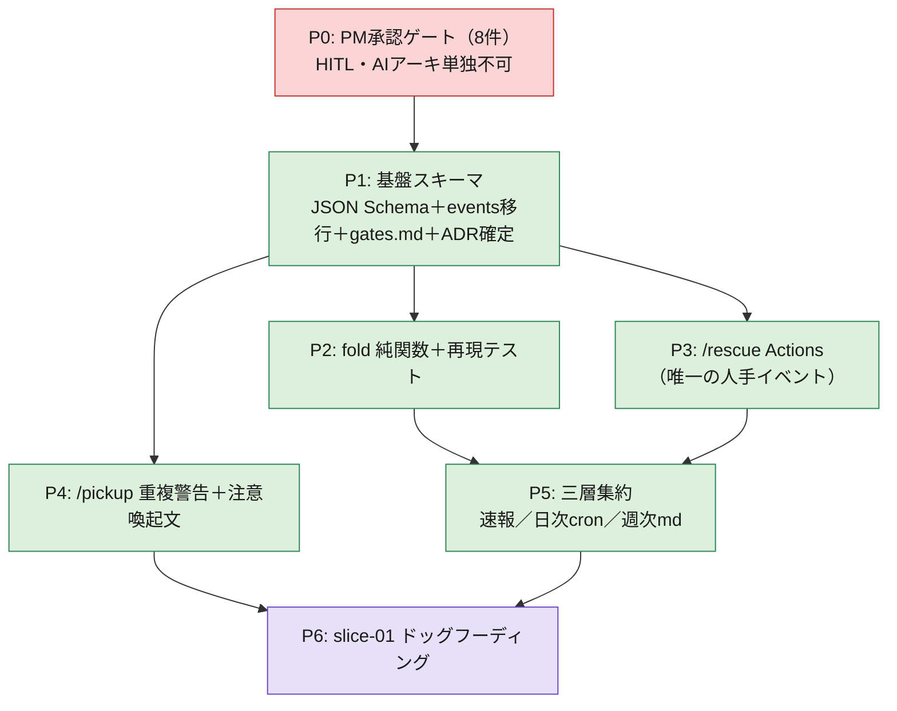

# スライス進捗集計アプリ — 実装ロードマップ（v0）

確定ログ §4（PM承認待ち8件）〜 §6（実装の初手）を、**依存順・担当・AFK/HITL・成果物・完了基準**の
形に畳んだ着手計画。対象は **v0（GitHub Actions 投影型・サーバー/DB なし・GitHub Pages なし）** のみ。
v1（Express + SQLite + Next.js ダッシュボード・`depends_on`・Pages）は本ロードマップの範囲外。

**大原則（不変）**：集計器は Git への投影（projection / read model）。**読むだけ。**
唯一の書き込みは `/rescue`（bot 経由）と集計器自身が生成する派生物のみ。

---

## 0. 位置づけと前提

- **これは MVP 本体ではない。** M-team 計画書 §3「TS完成＝MVPの終点」に含まれない。
  Harness-Keeper の道具として `tools/slice-aggregator/`（または `.github/` 内の workflow 群）に置く。所有は **AIアーキ／Harness-Keeper**。
- **既存 metrics フォーマットからの移行を伴う。** 現状は Markdown 表 `docs/metrics/slices.md`（`/submit` が1行追記）。
  確定ログは記録を **NDJSON イベント `docs/metrics/events/slice-NNNN.jsonl`** に移す。この移行が P1 の中心。
- **CLAUDE.md 禁止事項との関係**：集計器は読むだけなので原則すべて無抵触。唯一 `/rescue` の bot 直コミットが
  「main を進める操作は統合役1人」に例外を1本開ける → だから **ADR-0012 として明文化し、PM 承認を先に取る**（P0）。

### この計画が触る／触らないファイル

| 触る（新規・生成） | 触らない（read-only で読むだけ） |
|---|---|
| `docs/metrics/events/**`（イベント・append-only） | `docs/slices/**`（指示書＝タスク定義） |
| `docs/metrics/index/slice-map.json`（派生物） | `acceptance/**`・`reference-mock/**`（ADR-0001/0005） |
| `docs/status/daily/**`・`docs/status/weekly/**`（派生物） | `backend/**`・`frontend/**` |
| `docs/adr/0012-*.md`・`0007` 改訂 | 既存 `docs/metrics/slices.md`（移行後は非推奨・当面併存） |
| `.github/workflows/`（rescue・schema検証・cron） | `CLAUDE.md`（変更は PM 承認） |
| `.claude/skills/`（`/pickup` 冒頭注意文の追記のみ） | |

---

## 1. フェーズ全体像（ゲート順）

**クリティカルパス**：P0 → P1 →（P2 ∥ P3）→ P5 → P6。P4 は P1 後に並列可。
**P0 が通らない限り着手しない**（KPI 定義・ADR がAIアーキ単独では変えられないため。CLAUDE.md §7）。

---

## 2. P0：PM 承認ゲート（8件） — HITL

**担当**：AIアーキが承認パッケージを起票 → **PM が GO/NO-GO**。**AFK 不可（HITL）。**
**成果物**：8件を1枚にした承認依頼＋ADR-0012 ドラフト＋ADR-0007 改訂ドラフト。
**完了基準**：8件すべてに PM の GO が付き、ADR-0012 が `Accepted`、ADR-0007 改訂が反映される。

| # | 承認事項 | 種別 | 効く KPI |
|---|---|---|---|
| 1 | 完走率の分母に `abandoned:failed` を含める | KPI定義 | AFK完走率（生存者バイアス防止） |
| 2 | 肥大率の再定義（分子=diff行数＋所要日数＋`split`／「2回超」廃止） | KPI定義 | スライス肥大率 |
| 3 | 枠効率の分子＝破棄分を含む全消費 | KPI定義 | 枠効率 |
| 4 | 差し戻し率の分子＝`統合役NG ＋ NO-GO:rework` のみ | KPI定義 | 差し戻し率 |
| 5 | §1 計測項目「再作成回数」の廃止 | 計画書改訂 | 肥大率の取得方法 |
| 6 | `gates.md` に `NO-GO:rework/redecompose` 区別を必須化（**ADR-0007 改訂**） | ADR | 差し戻し率／肥大率の切り分け |
| 7 | **ADR-0012 新設**（metrics events への bot 直コミット許可） | ADR | 書き込み経路の正当化 |
| 8 | 指示書進捗 据え置き＋週次消化件数を Flywheel 観察項目に追加 | 計画書改訂 | 観察指標 |

> **注意**：`docs/metrics/gates.md` 自体がまだ存在しない（playbook「ハーネス未実装 #9」）。
> #6 の改訂は「gates.md を新規作成し、最初から NO-GO 種別フィールドを持たせる」形で実装する（P1 に落ちる）。

---

## 3. P1：基盤スキーマ（events 移行の中心）

**担当**：AIアーキ。**AFK 可**（PM 承認済みの枠内・仕様変更なし）。
**依存**：P0 完了。
**成果物**：
1. `schemas/slice-event.schema.json` — 1イベント=1行の NDJSON スキーマ（確定ログ §7 の7 type: `issued/submitted/rescued/rejected/gate/abandoned/completed`）。
2. `.github/workflows/validate-events.yml` — PR 時に全 `docs/metrics/events/**/*.jsonl` を schema 検証し欠損を弾く（既存 `guard-acceptance.yml` と同じ path-guard 系譜）。
3. `docs/metrics/gates.md`（新規）— GO/NO-GO 記録に `kind: rework|redecompose` フィールド必須（ADR-0007 改訂の実体）。
4. `issued` イベント発火：`spec/* merged` webhook で指示書 frontmatter の `slice_id`（＋任意 `issue`）を読み `issued` に載せる（確定ログ #H）。
5. 既存 `docs/metrics/slices.md` の扱い決定（当面併存 or 変換スクリプトで events へ一括移行）。

**完了基準**：
- 不正な `.jsonl` 行を含む PR が CI で赤くなる（正常系サンプルは緑）。
- `event_id` が決定論的（`gh-comment-<id>` 等）で、同一 webhook 再実行が二重行を生まない（冪等）。
- `gates.md` が NO-GO 種別なしの記録を弾く。

**主要な設計制約（確定ログ由来）**：
- `slice_id` が主キー（不変・再利用禁止・単調増加）。ファイルパスは主キーにしない。
- events はスライス別ファイル＋append-only（別スライスは別ファイル＝突合が原理的に起きない・確定ログ #J）。

---

## 4. P2：fold 純関数＋再現テスト

**担当**：AIアーキ（実装）＋ runner でテスト。**AFK 可。**
**依存**：P1（スキーマ確定）。**P3 と並列可。**
**成果物**：
1. `fold(events, as_of) -> status` を**純関数**として実装（確定ログ §6-2）。状態は常に `fold(events)` から再構成。
2. `(commit, as_of)` 単位の**過去スナップショット再現テスト**：日次で過去7日を再計算し、入力ハッシュ一致かつ結果不一致なら CI fail（非決定性検出）。
3. 速報層の健全性指標 `reconciliation_delta_rate`（週次の数字1つ）。※作業ログの「drift ログ」は確定ログで廃止済み。

**完了基準**：
- 同一 events 列から `fold` が常に同一 status を返す（決定性テスト緑）。
- 状態機械（作業ログ 5-2）の全遷移＝起票済→進行中→検証中→完了／破棄、および救援フラグ別軸、が単体テストで網羅。
- KPI 6指標（確定ログ §3 表）が `fold` 出力から算出でき、分母定義が承認済み定義（P0）と一致。

**コスト注記**：7日再計算は Actions/gh API を圧迫しうる。slice が増えたら「直近1日再計算」へ縮める（v0 は7日）。

---

## 5. P3：`/rescue` Actions（唯一の人手イベント）

**担当**：AIアーキ（実装）／運用時は**リーダーが記録・HITL**。**実装は AFK 可。**
**依存**：P1（events スキーマ・slice_id 解決の `issued` 発火）。**P2 と並列可。**
**成果物**：
1. `.github/workflows/rescue.yml` — issue/PR コメント `/rescue <理由>`（`--slice <N>` 任意）を検知し JSON1行を生成、`docs/metrics/events/slice-NNNN.jsonl` に **bot が append-only 直コミット**（ADR-0012 の実体）。
2. slice_id 解決：①`--slice` 明示 ②PR ヘッドブランチ `feature/slice-NNNN-*` ③issue 本文の指示書リンク。**解決不能なら記録せず返信で打ち直しを促す**（誤記録＞記録漏れの非対称性）。
3. 応答 UX：👀（受理）→ ✅（記録）／❌（失敗）をコメントに焼く。打ち消しは `/unrescue`（`rescue_revoked` 追記・行は消さない）。

**セキュリティ完了基準（必須）**：
- コメント本文は `env` 経由で渡す（`${{ }}` 直挿し禁止＝script injection 対策）。
- 投稿者を上流3名に allowlist（`vars.UPSTREAM_MEMBERS`）。
- `pull_request_target` を使わない。書き込みパスを `docs/metrics/events/**`・`docs/metrics/index/**`・`docs/status/**` に限定。
- `event_id = "gh-comment-" + comment.id`（冪等）、`at = comment.created_at`。

---

## 6. P4：`/pickup` 重複警告＋注意喚起文（advisory）

**担当**：AIアーキ（skill 改修）／判断は**リーダー**。**AFK 可。**
**依存**：P1（範囲データの読み取り）。**P6 の前まで。**
**成果物**：
1. `/pickup` skill に **スライス重複警告**：open な `feature/*` ブランチのファイル範囲（指示書必須項目3「触ってよい範囲」）と交差検知し警告（read-only・advisory・下流の権限に触れない）。範囲交差＝独立縦切りの失敗＝分解の欠陥シグナルとして週次にも計上。
2. `/pickup` の SKILL.md 冒頭に **再作成2回超の注意喚起文**（GitHub 計測はやめ、リーダー判断で運用。発火結果は `abandoned:split` として自然に記録）。

**完了基準**：
- 範囲が交差する2ブランチで `/pickup` すると警告が出る／交差しなければ無音。
- 警告は**強制しない**（強制は §4 ガード＋git-guardrails が担う）。集計器は authority を持たない（確定ログ #K）。

---

## 7. P5：三層集約（速報／日次／週次）

**担当**：AIアーキ。**AFK 可。**
**依存**：P2（fold）＋ P3（events が溜まる）。
**成果物**：
1. **① 速報**：PR コメントに現在地1行（自分の PR にのみ）。
2. **② 日次 cron**：全件再計算 → `docs/metrics/index/slice-map.json`・`docs/status/daily/YYYY-MM-DD.json` を生成。**集約を書くのは日次 cron 1本だけ**（`/submit` は集約を触らない＝書き手1つ＝突合ゼロ・確定ログ #J）。
3. **③ 週次**：`docs/status/weekly/YYYY-Www.md`（Harness-Keeper が読む・移動平均カーブ・Flywheel 観察項目を自動抽出）。

**完了基準**：
- 全書き込みジョブに `concurrency: { group: metrics-write, cancel-in-progress: false }`。
- **GitHub Pages を作らない**（v0 は Markdown 出力のみ。Pages は v1 へ延期・確定ログ #I）。
- 日次が最大24h 古いことを許容（集約を見るのは週次レビューのみ）。

---

## 8. P6：slice-01 ドッグフーディング

**担当**：M-team 全員（下流が slice-01 を回し、集計器が裏で観測）。**AFK 完走を実測する回。**
**依存**：P2・P3・P4・P5 完了。
**成果物**：slice-01（報告→要約→確認→確定 の縦切り）を実際に `/slice`→緑→PR→統合→ゲートまで通し、
その全イベントが events に載り、週次 md に AFK完走率・差し戻し率・肥大率が出ることを確認。
**完了基準**：
- slice-01 の状態遷移が events から `fold` で正しく再構成される。
- 枠消費は §6 候補1（`~/.claude/projects/**/*.jsonl`）を AIアーキが実機検証。取れなければ `null`（北極星は生存）。
- ダッシュボード（週次 md）が「最初の1本」の KPI を表示。以後は Flywheel で育てる。

---

## 9. 担当 × AFK/HITL 早見表

| フェーズ | 主担当 | 承認/判定 | AFK/HITL | 並列 |
|---|---|---|---|---|
| P0 承認ゲート | AIアーキ（起票） | **PM（GO/NO-GO）** | HITL | — |
| P1 基盤スキーマ | AIアーキ | — | AFK | — |
| P2 fold＋再現テスト | AIアーキ | — | AFK | P3 と並列 |
| P3 /rescue Actions | AIアーキ | 運用時リーダー記録 | 実装AFK／運用HITL | P2 と並列 |
| P4 /pickup 警告 | AIアーキ | 運用時リーダー判断 | AFK | P1 後いつでも |
| P5 三層集約 | AIアーキ | — | AFK | — |
| P6 ドッグフーディング | 下流＋全員 | 統合役再検証→PM ゲート | HITL（本番運用） | — |

---

## 10. リスク・未検証（着手前に潰す／観測する）

| # | リスク／未検証 | 対応 |
|---|---|---|
| 1 | **枠消費の取得元が未定**（§6）。`Settings > Usage` が正本なら自動化不可 | 候補1をP6で実機検証。だめなら `null` 許容（北極星に影響なし） |
| 2 | Claude Code の transcript 仕様が動きが速く、本ログ時点の知識が古い可能性 | AIアーキが実機で確認してから実装 |
| 3 | `slices.md`（表）→ events（NDJSON）移行の二重管理期間 | P1 で「併存 or 一括変換」を決める。`/submit` の追記先切替を明記 |
| 4 | 7日再計算の API レートリミット | slice 増で「1日再計算」へ縮小（検出力↓・コスト1/7） |
| 5 | bot 直コミットが ADR-0004（ブランチ名で書込権判定）に例外を作る | ADR-0012 に allowlist＋schema＋パス限定＋append-only を明記し正当化（P0で承認） |

---

## 11. 整合性チェック（CLAUDE.md / ADR）

- **CLAUDE.md §1 禁止**：集計器は読むだけ＝main を進めない・migration しない・acceptance/reference-mock を触らない、すべて無抵触。`/rescue` の bot 直コミットのみ例外だが **ADR-0012 で明文化・パス限定**。✅
- **ADR-0001（acceptance read-only）**：集計器は acceptance/ を読まない・書かない。✅
- **ADR-0004（ブランチで書込権判定）**：bot 例外を1本追加（ADR-0012 が正当化）。⚠→P0で承認
- **ADR-0006（指示書の正本＝docs/slices）**：集計器は指示書を read-only 参照。issue 本文は信頼しない。✅
- **ADR-0007（全PRにゲート・PM判定）**：改訂で NO-GO 種別を必須化（P0 #6）。⚠→P0で承認
- **ADR-0011（Express 層構造）**：v0 は GitHub Actions のみで backend を持たない＝抵触なし。v1 で `router→service→repository` の練習台になる。✅

---

## 12. 直近アクション（P0 を動かす）

1. AIアーキ：P0 の承認パッケージ（本書 §2 の8件表＋ADR-0012 ドラフト＋ADR-0007 改訂差分）を PM に提出。
2. PM：8件を GO/NO-GO。特に #1・#6・#7 は KPI の意味と不可逆性に直結するため diff を読む（`irreversible` 相当）。
3. 承認後、P1 に着手（JSON Schema → gates.md → validate-events CI）。

---

## 参照
- `2026-07-11_slice-progress-aggregator_確定ログ.md`（#A〜#K・KPI定義・ADRドラフト・events スキーマ）
- `2026-07-10_slice-progress-aggregator_作業ログ.md`（処理フロー Mermaid 4図・三層集約の肝）
- `M-team開発計画書_v2.md`（v2.3）§1 成功基準 / §2 所有マップ / §7 役割 / §9 コマンド
- `docs/playbook.md`（ロードマップ表・ハーネス未実装 #9 gates.md）
- `docs/metrics/slices.md`（現行 metrics フォーマット＝移行元）
- `.github/workflows/guard-acceptance.yml`（既存 path-guard・CI 系譜）
- ADR-0001・0004・0006・0007（改訂）・0011・0012（新設）
