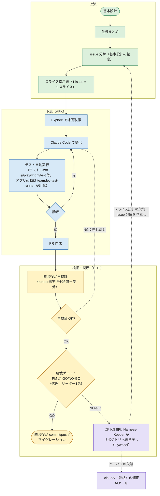
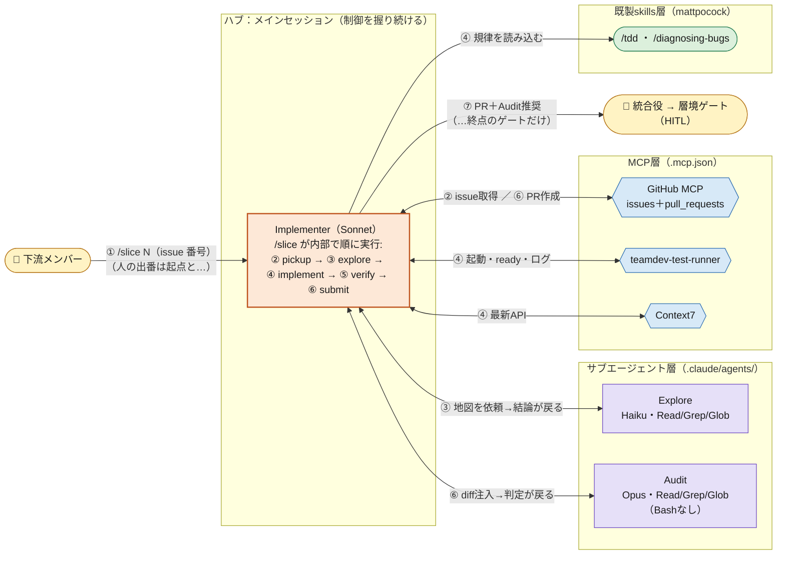

# M-team：AI駆動開発 — 開発計画書 v2

作成日: 2026-07-06（v1: 2026-07-02 作成、2026-07-03 grill 第2回反映）／**v2.1: 2026-07-07（ハーネス・エンジニアリング調査＋skills 調査 §4b を反映）**
位置づけ: v1 の設計判断・ADR はすべて維持し、**2026-07-06 実施の公式ドキュメント調査4本（マルチエージェント / skills / MCP / Claude Pro）の知見を運用レベルに反映**した改訂版。既存 staff-report-system（＝Repo Base）を「参照仕様（モックアップ）」とし、AI駆動のチーム開発で**本命ラインを新スタックで作り直す**計画であることは変わらない。

---

## v1 → v2 変更点サマリー

判断（A主・C従、NestJS 採用〔v2.2 で Express に変更。ADR-0011〕、ブラックボックス受け入れテスト、直列既定、Opus温存）は**一切変えていない**。変更はすべて「同じ判断を 2026-07 時点の公式仕様・ベストプラクティスでより確実に実行するための運用強化」である。

| 章 | v2 での変更 | 根拠（調査） |
|---|---|---|
| §0 | 参照資料に「M-team ナレッジベース（KB-00〜06）」を追加 | ─ |
| §2 | ファイル所有マップの `.claude/commands` を `.claude/skills` に統一 | skills 調査 §2（コマンドは skills に統合済み） |
| §4 | 統合役再検証に「issue 本文＝信頼できない入力」の観点を追加 | MCP 調査 §4（プロンプトインジェクション） |
| §5 MCP | セキュリティ注記を追加（ツール注釈に強制力なし・トークンは環境変数・未使用サーバー無効化） | MCP 調査 §4 |
| §5 skills | 実装先を `.claude/skills/` に一本化。invocation control（`disable-model-invocation` 等）と設計原則・メンテ運用を規定 | skills 調査 §1〜6 |
| §5 エージェント | frontmatter 拡張を反映（`maxTurns` / `memory` / `effort` / `disallowedTools` / 返却フォーマット規定）。バックグラウンド実行デフォルト化（v2.1.198〜）への対応方針を明記 | マルチエージェント調査 §1・§4 |
| §5 新節 | **「Pro 枠の運用規範」を新設**（使用量2層構造・5習慣・確認コマンド・使用量クレジット） | Claude Pro 調査 §2〜4 |
| §6 | hooks による決定論的ゲート（`Stop` 等）を安全装置に追加。「LLMレビュー＋決定論チェック」の二重ゲート化 | マルチエージェント調査 §3 |
| §7 | CLAUDE.md 運用ルール（200行以内・2ストライク・棚卸し）を明文化。成果物駆動＝structured note-taking の理論的裏付けを追記 | マルチエージェント調査 §3 |
| §9 | 自作コマンド群を skills として実装、手動専用に invocation control 適用。compaction 時のスキル持ち越し挙動を運用注意に追加 | skills 調査 §1〜2 |
| §10 | MCP 次期仕様（2026-07-28 確定予定）の影響評価を追記 | MCP 調査 §6 |
| 付録B/C | 未決事項（skills eval 運用・次期仕様ウォッチ）と出典（調査4本・公式ドキュメント）を追加 | ─ |

---

## v2 → v2.1 変更点サマリー（2026-07-07）

ハーネス・エンジニアリング調査（2026-07-07、実在リポ実例 §8b 含む）と skills 調査 §4b（人気 skills リポ深掘り）を反映。設計判断は原則維持だが、**spec-kit の扱いのみ「丸ごと採用」→「テンプレのみ抜粋」に改訂**（唯一の判断変更。根拠は §5）。

| 章 | v2.1 での変更 | 根拠（調査） |
|---|---|---|
| §0 | 別冊 KB の参照を KB-00〜06 → **KB-00〜07**（KB-07: ハーネス設計）に更新 | ─ |
| §5 skills | **spec-kit を「上流の背骨（丸ごと採用）」→「テンプレのみ抜粋」に改訂**。PM 仕様表正本との衝突・`/speckit.implement` と役割分離の不整合・メンテ体制変化が理由 | skills 調査 §4b-6 |
| §5 skills | Audit 用に **優先度付きレビュールール集スキル（監査型）を自作**する方針を追加（Vercel 型。read-only と完全整合）。※v2.2 で Express 版に差し替え | skills 調査 §4b-3 |
| §5 エージェント | Audit の雛形＝claude-code-showcase `code-reviewer.md` 形式を採用。レビュー観点は「正しさと要件に影響するギャップのみ報告」と絞る | ハーネス調査 §8b-1・§4 |
| §6 | hooks を**三層モデル（宣言／実行時強制／事後検証）**で再整理。PreToolUse deny-list・protect-paths（`acceptance/` 書込ブロック）・PostToolUse 非ブロッキング feedback・exit code セマンティクス・hook I/O の JSON ログ化を規定 | ハーネス調査 §3・§8b |
| §6 | **ADR-0001 の機械検証**: `acceptance/` に触れる PR を CI の path ガードで fail させる（宣言＋強制のペア設計） | ハーネス調査 §9 |
| §7 | CLAUDE.md 剪定基準「**この行を消したら Claude はミスをするか**」を追加。「破られ続けるルールは hook に昇格」（2ストライク→hook昇格の階段）。昇格候補はメモリバンク分割で隔離し PM 承認後に本体統合 | ハーネス調査 §3-1・§6・§8b |
| §9 | Implementer に数値つき自動停止トリガー（同一エラー2回で停止・5ファイル変更で影響報告）を輸入 | ハーネス調査 §8b（shinpr） |
| §8 | キックオフに段階導入ロードマップ（Step 1: 剪定＋危険コマンドブロック＝効果最大・コスト最小）を対応づけ | ハーネス調査 §8 |
| 付録B | 未決に追加: カスタム lint エラーメッセージへの修正指示埋め込み・doc-gardening 定期実行・gh-aw CI Doctor 型の保守部品 | ハーネス調査 §9・§8b-5 |
| 付録C | 出典にハーネス調査（＋実在リポ実例）・skills §4b を追加。「部品抜粋・丸ごと導入しない」方針の裏付けとして GSD 本家アーカイブ事件を記録 | 両調査 |

---

## v2.1 → v2.2 変更点サマリー（2026-07-09）

`grill-with-docs`（テーマ：**基本設計から PR 作成までの手順**）で計画書の**実行不能な穴を8件**発見し、決定を **ADR-0004〜0011** として記録した。手順の正本は新設した **`docs/playbook.md`**。本サマリーは索引であり、詳細は各 ADR を正とする。

| # | 発見した穴 | 決定 | ADR |
|---|---|---|---|
| 1 | **PR が作れない** — commit/push 全面禁止と「`/submit` が PR 作成」が矛盾し、AFK 区間に終点が無かった | 禁止事項を「**main を進める操作＋DBマイグレーション**」に絞る。作業ブランチの commit/push はエージェントに許可 | （§6・§9 改訂） |
| 2 | **`acceptance/` を誰も置けない** — 三層すべてで無条件ブロックし、正当な書き手（上流）まで締め出していた | 書込権を**ブランチ名**で判定。`spec/*` は `acceptance/` 可・実装不可、`feature/*` はその逆 | **ADR-0004** |
| 3 | **answer key 検証が物理的に不可能** — 参照モックは別リポ、runner は repo 外を refuse | 参照モックを `reference-mock/` に **vendor**。`acceptance/` は `ACCEPTANCE_BASE_URL` で対象を切替 | **ADR-0005** |
| 4 | **信頼境界が引けない** — 「issue 本文は信頼できない入力」と言いながら指示書を issue 本文に置いていた | 指示書の正本は **`docs/slices/slice-NN.md`**。issue はポインタに降格 | **ADR-0006** |
| 5 | **ゲートが二枚舌** — §2「不可逆変更のみ」と §9「全スライス」 | **全 PR にゲート。重さを2段**（軽量／重量）。`irreversible` ラベルは CI が機械的に貼る。**判定者はリーダー→PM**（代理はリーダー1名、記録必須） | **ADR-0007** |
| 6 | **3判定の1つが主観** — 「画面がモック通り」を人が目で見比べていた | **golden スクリーンショット**を `acceptance/golden/` に置き `toHaveScreenshot()` で機械判定。撮るのは `spec/*` 工程（実装より先） | **ADR-0008** |
| 7 | **上流に型が無い** — 下流だけ一本道で、上流は素の会話 | コマンド化の基準を「**繰り返す × 手順が固定 × 間違うと痛い**」とし、**`/spec` `/brief` の2本だけ**追加。工程とブランチの対応を hook で縛る | **ADR-0009** |
| 8 | **統合役の再検証スコープが未決**（付録B） | 検出したいものが別物として分割。**人＝再現性（当該スライス）／機械＝リグレッション（CI が全スイート）**。CI 導入は「スライス5本 or 初スプリント末」に期限を切る | **ADR-0010** |

さらに **バックエンドを NestJS → Express に変更**（**ADR-0011**、ADR-0002 を supersede）。
ただし ADR-0002 の核心（**構造が Spring と 1:1 であること**）は維持し、**強制の担い手をフレームワークからハーネスへ移した**：
`router → service → repository` の一方向依存を**規約＋カスタム lint（CI）**で強制する。

### 本書と手順書の関係

- **本書**＝なぜそう決めたか（判断と根拠）
- **`docs/playbook.md`**＝誰がいつ何をするか（人の動きの正本）
- **`docs/adr/`**＝個別決定の正本。本書と食い違ったら **ADR が正**

---

## 0. この計画書の使い方

本書は、2026-07-02 の設計対話（grill）で合意した内容を1本にまとめた v1 に、2026-07-06 の調査知見を反映した改訂版。以降の spec-kit 運用の入力になるよう章立てを対応させている（第1章→`constitution`、第8章→`specify` の下書き）。実装の正本は常に Git、判断の正本は本書＋リポジトリ内 `CLAUDE.md`、用語の正本は `CONTEXT.md`、個別決定は `docs/adr/`（ADR-0001: 受け入れテスト＝ブラックボックス専用、ADR-0011: Express＋構造規約〔ADR-0002 を supersede〕、ADR-0004〜0010: 2026-07-09 grill の決定）。**手順の正本は `docs/playbook.md`。** リポジトリ作成までの暫定置き場はプロジェクトフォルダ `M-team：AI駆動開発/`。

（v2追記）**技術詳細の参照先**: 本書は判断とルールに絞り、仕様の詳細（サブエージェント frontmatter 全項目、skills 設計チェックリスト、MCP 導入コマンド、Pro 制限の小技）は別冊「**M-team AI駆動開発 ナレッジベース 2026-07**（KB-00〜07、HTML 配布。v2.1 で KB-07: ハーネス設計を追加）」に置く。本書の各章から KB 番号で参照する。仕様確認は KB の出典（公式ドキュメント）最新版を正とする。

（2026-07-07 追記）**本書の呼称ルール（用語のブレ防止）**:
- **参照モック（answer key）**＝既存の `staff-report-system`（本プロジェクトでの通称 **Repo Base**）が示す「正解の挙動」。以降、この参照系を指すときは**「参照モック」に統一**する。実装フレームワークが論点になる箇所（テスト自体の検証・移行の起点など）でのみ **「FastAPI モック」** と呼ぶ。
- **ハーネス**＝ハーネス・エンジニアリングの方法論全体（guides/sensors/templates）。**特定ツール `teamdev-test-runner`（アプリ起動・監視の実行環境）を指すときは「runner」**と書き分ける（`harness_start` 等はツールの関数名なのでそのまま）。

---

## 1. 目的と前提（＝憲法の骨子 / constitution 入力）

### 第一目的：A主・C従

- **A（主）＝方法論の確立**：Repo Base を練習台に、「人がAIを動かすチーム開発」を**再現可能な型**として作る。成果物より仕組みが主。
- **C（従）＝成功体験**：初級メンバーが「AIで実装して動いた」を体感し、チームをAI駆動に慣れさせる。Aの副産物として自然に得る。
- B（純粋な機能前進）は主目的にしない。まず型を作り、その型で機能を回す。

### 前提

- 人がAIを動かして実装する。AIに丸投げしない。
- 上流工程と下流工程を**別の人**が担う。
- エージェント・skills・MCP を活用する。
- 知識は「個人 Vault＝上流の入力源」「チーム共有知＝リポジトリ内」に分離して活用し、外部検索で最新情報を補う。
- 全員 Claude Pro（緩衝 Max 席なし）。設計は Pro の週次枠に収める。（v2追記）このため **§5「Pro 枠の運用規範」を全員の必修事項**とする。使用量は claude.ai / Claude Code / Desktop / Cowork の**全サーフェスで同一プールを消費**する点に注意（Claude Pro 調査 §2）。

### 一番大事な原則（移行前提だからこそ）

> **型（方法論）は言語に依存しない形で作る。** コードは捨てても、上流成果物（要件・設計・原則・受け入れテスト）と運用ルール（層境ゲート・skills/MCP 運用・Feedback Flywheel）は流用できる資産にする。**受け入れテストが言語非依存の不変資産**であり、これが移行の完全仕様になる。

（v2追記）この原則は 2026 年時点の外部標準とも整合する: skills は **Agent Skills オープン標準**（agentskills.io）となり複数 AI ツール間で可搬、`.claude/agents/` の定義は **Agent SDK でそのまま再利用可能**。つまり本計画で作る `.claude/` 一式は、Claude Code に閉じない移植可能資産である（skills 調査 §1、マルチエージェント調査 §5）。

### 成功基準（プロセスKPI）

目的Aは「機能前進」ではなく「再現可能な型の確立」なので、成功は**機能の実装数ではなくプロセス指標**で測る。指標の運用詳細（計測・発火）は Feedback Flywheel（§7・§9）に載せる。

**A（主）の北極星＝AFK完走率**

- 定義: 1スライスが `/slice` 起点から緑＋PR まで、**ループ途中で人が救援せず**到達した割合。終点の層境ゲート（HITL）は"救援"に数えない。**リーダーへの一次質問での介入は救援＝未完走にカウント**（厳しめ。型の狙いは初級が無人で緑にできること）。
- 閾値: **絶対値固定でなく改善カーブで見る**。①**直近5スライスの移動平均が右肩上がり**であることを一次の成功条件、②MVP 終盤の暫定ゲート **≥70%（暫定・要較正）**。ベースラインが無いため slice-01〜05 の実測が出た時点で本較正する。分母は累積でなく**直近5の移動平均**（現在の型の健康を見るため）。
- 補助指標（北極星が割れたときの原因切り分け用）: **差し戻し率**（統合役NG＋層境ゲートNO-GO）・**スライス肥大率**（セッション再作成2回超）・**枠効率**（1スライスあたり Pro 枠消費＝$/task）。

**C（従）＝初回成功体験（客観プロキシ1本）**

- 定義: **各下流メンバーが最初の1スライスを完走体験するまでの日数**（Time-to-first-green／人）。**初スプリント内に下流全員が1回**「緑→PR→統合まで通る」を体験できたかを二値で見る（§8「最初の成功体験を通す」を直接指標化）。主観アンケートは入れない（初級への計測負荷を排除）。C は従なので**非ゲート**——未達でも計画を止めず、A側（型）の欠陥シグナルとして Flywheel に流す。

**計測と発火**

- **計測**: `/submit` の返却に**1行の構造化記録**（`救援有無 / 再作成回数 / 枠消費 / 差し戻し理由`）を焼き込み、`docs/metrics/` に追記（§7 structured note-taking と同型）。自動で取れる項目（再作成・枠・差し戻し）はログ/git から自動、**救援有無は初級の自己申告を避け、リーダーが窓口対応時に記録**する（過少申告防止）。**所有は Harness-Keeper（AIアーキ）**、レビューはスプリント末の骨格見直し（§5・§8）。
- **発火**: 指標割れ（改善カーブが平ら／70%未達／初スプリント内に初回完走できない人がいる）は罰でも即作業でもなく **Flywheel の観察項目**。発火時は必ず原因を**「スライス設計の欠陥（大きすぎ・受入基準過多）」か「ハーネスの欠陥（枠・skills・hooks）」か**に2分類してから対策し、CLAUDE.md/hook 昇格は既存の2ストライク→昇格の階段に載せる。

---

## 2. 体制と役割

総勢 5〜6 名。上流3・下流2〜3。

### 上流（3名）

| 役割 | 担当 |
|---|---|
| **PM** | 要件定義・仕様決定・**受け入れテストの用意** |
| **AIアーキテクト** | AIを動かす骨格（ハーネス・エージェント・構造）の決定、skills/エージェント選定 |
| **リーダー** | 下流の窓口（一次質問対応）、貼り付け用「枠」作成、禁止事項の管理 |

上流はコードを書かない（読んで判断はする）。基本設計の粒度で仕様をまとめ、issue に分解する。受け入れテストは PM が**仕様表（Given/When/Then）**を正本として書き、実行可能コードへの翻訳は AIアーキ（＋AI）が担う（"箱"側の仕事として例外扱い。ADR-0001）。

### 下流（2〜3名）

| 役割 | スキル前提 | 担当 |
|---|---|---|
| **実装メンバー（初級）** | コーディング初級 | feature ブランチ上で Claude Code を回し、**受け入れテストを緑にする**。緑になったら PR。main には触らない・自分では push しない。 |
| **統合役（中級）** | Git/DB 中級 | PR を受け、runner 再実行＋シークレットチェック＋差分確認 → **commit/push/マイグレーションを実行**。不可逆操作をこの1点に集約。 |

### 承認の分担（層境ゲート）

- **実行**：下流の統合役（中級者）
- **GO/NO-GO 判断**：**PM**（代理：リーダー1名のみ・`docs/metrics/gates.md` に記録必須。ADR-0007）。全 PR にゲートを掛け、重さ（軽量／重量）は CI の `irreversible` ラベルが機械的に決める

### ファイル所有マップ（「箱」＝仕組み vs 「中身」＝文言）

AIアーキは `.claude/` の仕組みと配線を構築・所有するが、原則・テスト・枠の"文言"は PM/リーダーが正本。AIアーキが仕様判断をしない（実装ツールに設計判断させない、と同じ線引き）。

（v2改訂）`.claude/commands` の行を `.claude/skills` に変更。2026 年時点でカスタムコマンドは skills に統合済みであり（両方動くが skills 推奨、同名は skill が勝つ）、**新規は skills 一択**（skills 調査 §2）。

| ファイル / 対象                                   | 置き場所                            | 構築（箱）            | 中身（文言）                    |
| ------------------------------------------- | ------------------------------- | ---------------- | ------------------------- |
| `.claude/agents/*.md`（Explore・Audit）        | `.claude/`                      | **AIアーキ**        | AIアーキ                     |
| `.claude/skills/`（`/slice` ほかラッパー。旧 commands） | `.claude/`                      | **AIアーキ**        | 骨組みはAIアーキ／枠・禁止事項は**リーダー** |
| `.claude/settings.json`（フック/権限/marketplace） | `.claude/`                      | **AIアーキ**        | AIアーキ                     |
| `.mcp.json`（MCP接続・runner同梱）                | **repoルート**                     | **AIアーキ**        | AIアーキ                     |
| 既製skills導入（mattpocock。spec-kit はテンプレ抜粋のみ＝v2.1）  | `.claude/`                      | **AIアーキ**        | —                         |
| `CLAUDE.md`（憲法／constitution）                | **repoルート**                     | AIアーキ（体裁）        | **PM**（上流全体で合意）           |
| 受け入れテスト                                     | **`acceptance/`（実装から独立・言語非依存）** | AIアーキ（仕様表→コード翻訳） | **PM**（仕様表が正本）            |
| ADR / CONTEXT.md（チーム脳）                      | `docs/`                         | AIアーキ（雛形）        | 上流全体＋Harness-Keeper が書き戻し |

> 注意：`CLAUDE.md` と `.mcp.json` は `.claude/` の**中ではなく repo ルート**。「claudeフォルダ内」だけだとこの2つが漏れる。
>
> （v2追記）`.claude/skills/`・`.claude/agents/` は **git 管理し、変更を PR レビュー対象にする**（skills 調査の設計原則10）。「箱」の変更もチームの目を通す。

---

## 3. スタックと移行方針

### スタック

| 段階 | バックエンド | フロント | 位置づけ |
|---|---|---|---|
| 参照仕様（既存モック） | FastAPI / Python | Next.js / TS | 「正解の挙動」。answer key。 |
| **初期** | **TypeScript（Express ＋ 構造規約）** | Next.js / TS | 全型・全テストを最速で立ち上げる踏み台。TS一本化。 |
| **最終（A＝チーム母国語）** | **Java / Spring Boot** | Next.js / TS 維持 | チームが母国語で持つ本命。 |

AI（要約）はプロバイダー非依存の抽象化層（Summarizer）経由で呼ぶ方針を踏襲（既存原則2）。

> **Express 採用理由（ADR-0011。ADR-0002 を supersede）**：初級者にデコレータと DI を同時に教える負荷が高く、AI が生成するボイラープレートを人が読めないと目的C（成功体験）が損なわれる。
> ただし ADR-0002 の核心は「NestJS が好き」ではなく「**構造が Spring と 1:1 であること**」だった。その構造は Express でも規約で作れるので、**強制の担い手をフレームワークからハーネスへ移す**。
>
> ```
> backend/src/<feature>/
> ├── <feature>.router.ts       ← Spring: @RestController
> ├── <feature>.service.ts      ← Spring: @Service
> ├── <feature>.repository.ts   ← Spring: @Repository
> └── <feature>.schema.ts       ← Spring: DTO + Bean Validation
> ```
>
> 依存の向きは **router → service → repository の一方向のみ**。逆流・飛び越しは**カスタム lint が CI で fail** させる。`app.ts` が唯一の合成ルート。宣言→実行時強制→事後検証という本計画の思想とは、フレームワーク任せよりむしろ整合する。
> 受け入れテストはブラックボックス（ADR-0001）なので、**テスト資産・golden はフレームワーク変更の影響を受けない**——ここが ADR-0001 の配当である。

### 移行方針：(a) 一括移行 ＋ 安全装置

- **作り方**：まず全機能を TS で作り切る（AIで最速に全型＋全テスト）。**完成後に一括で Java/Spring へ再実装**する。
- **安全装置（big-bang rewrite の事故防止）**：
  1. **TS で貯めた全受け入れテスト＝Java 移行の完全仕様**。受け入れテストは**ブラックボックス専用**（起動済みサーバーへの実 HTTP＋Playwright E2E。in-process/unit を含めない）で `acceptance/` に置き、先に既存 FastAPI モック（answer key）へ流してテスト自体を検証する（ADR-0001）。移行は"書き直し"でなく「同じ緑を Java で再現するテスト駆動再実装」。終点が明確（全テスト緑＝完了）で乖離しない。
  2. **移行期間中は TS 側を機能凍結**（並行開発しない）。
  3. 移行実行は AIアーキ＋Java中級者、承認は PM（層境ゲートと同じ。代理：リーダー1名。ADR-0007）。
  4. Context7 が Spring のドキュメントを供給し、"存在しないAPI"リトライを抑える。
- **意味づけ**：同じテストを Java で緑にできれば、**A主（型は言語非依存）が実証される**。移行は雑務でなく「方法論の総仕上げ＆母国語での所有権獲得」。

### TS 完成＝MVP の終点

- **含む**：参照モックのコア（報告→要約→確認→確定）＋スキルシート生成まで。
- **含まない**：Phase 3（音声・通知・スタッフケア）は既存同様デモUIのみ。移行対象外。

---

## 4. 開発フロー



> 凡例：**緑＝上流／青＝下流（AFK）／黄＝検証・関所（HITL）／紫＝Flywheel 書き戻し**。赤→緑化の実線ループはテスト緑までの AFK ループ。点線＝例外フロー：統合役の再検証 NG は層境ゲートに進まず下流の緑化へ差し戻し、層境ゲート NO-GO は Harness-Keeper が**原因を2分類**（`docs/playbook.md` 工程10。飛ばさない）——スライス設計の欠陥は issue 分解の見直しへ、ハーネスの欠陥は `.claude/`（骨格）の修正へ。修正後、下流は `/pickup` から再開する。

### 上流工程の詳細（issue 分解）

**issue 分解（基本設計の粒度）** — 上流がまとめた仕様を、下流が1単位ずつ消化できる issue 群に切り分ける工程。**1 issue = 1 スライス = 1 セッション**が原則。

- **切り方は縦切り（tracer bullet）**：層別（バックエンドだけ・画面だけ）ではなく、「報告入力の受付」のように**API＋画面＋テストを貫通する最小の縦スライス**で切る（§8 のコア縦切りが初例）。道具は `to-tickets`（mattpocock/skills、§5。v2.3: v1.1 で `to-issues`＋`to-plan` が `to-tickets` に統合）。spec-kit の流れでは `tasks` に相当し、「基本設計→仕様→issue分解→スライス指示書」の3段目（§5）。
- **粒度の基準**：受入基準 **≤3〜5** に収まること（§5 の 1 session = 1 issue）。粒度検証は運用が担う——1スライスでセッション再作成が2回超、または diff がコンテキストに収まらない場合は「スライスが大きすぎる」＝**分解のバグ**として Flywheel の観察項目へ（§9）。
- **分担**（§4 スライス指示書の分担と同一）：**PM**＝優先順位・順序・依存関係の決定＋各 issue に対応する受け入れテストの仕様表、**AIアーキ**＝技術的な形（API・データ形）、**リーダー**＝枠・禁止事項。
- **置き場所と受け渡し**：issue は GitHub に置き（GitHub MCP の toolsets＝issues＋pull_requests、§5）、各 issue をスライス指示書（必須6項目）に仕上げて下流へ渡す。下流は `/pickup <issue>` で取得して着手する（§9）。
- **狙い**：下流の AFK ループが1コンテキストで完走できるサイズに刻むことで、「緑になるまで無人で回り、判定だけ人に載る」フロー全体が成立する。分解の質＝下流の成功率。

### 下流2工程の詳細（Explore で地図取得／Claude Code で緑化）

**Explore で地図取得（`/explore`）** — 実装前に、コードベースの「地図」＝スライス指示書「3. 触ってよいファイル範囲」に対応する構造把握をサブエージェントに任せる工程。

- 実体は `.claude/agents/explore.md` のサブエージェント。tools は **Read/Grep/Glob のみ**（read-only。Bash・MCP なし）、モデルは **Haiku**（§5）。
- メインセッション（Implementer）が呼び出し、Explore は探索して**結論だけ返す**（ファイルダンプは返さない）。次工程を自分では起動しない使い捨ての作業員＝ハブ＆スポーク（§9）。
- 狙い：メインセッションのコンテキストを汚さず、安いモデルで探索を済ませて Pro 枠を節約する。
- （v2追記）**組み込み Explore との区別**: Claude Code 組み込みの Explore/Plan は CLAUDE.md・git status を**読まない**（高速優先）。M-team の自作 `explore.md` は通常のサブエージェントなので CLAUDE.md 階層を読む。憲法（禁止事項）を知った上で地図を作らせたいので**自作版を正とする**（マルチエージェント調査 §1-3）。

**Claude Code で緑化（`/implement`）** — メインセッション（Implementer・**Sonnet 既定**）が「貼り付け用の枠」に沿って実装し、受け入れテストを緑にするまでループする工程。

内部ループ：① `teamdev-test-runner` で harness_start → ready 待ち（アプリ起動は runner、採点はテストFW）→ ② `@playwright/test` 等を実行 → ③ 赤なら trace / screenshot / harness_logs を読んで修正・再実行 → ④ **緑になったら停止して報告**（勝手に commit しない）。

- 規律は `/tdd`（v2.3: v1.1 で red→green のみに縮小。refactor は `code-review` へ移管）、詰まったら `/diagnosing-bugs`。最新 API は Context7 が供給。
- 焼き込まれた禁止事項：commit/push/マイグレーション禁止・範囲外ファイル禁止・`acceptance/` 変更禁止（テスト＝仕様＝読み取り専用）。
- 制約の思想：1 session = 1 issue（受入基準 ≤3〜5）。「3回リトライして緑」はハーネスのバグ、1スライスでセッション再作成が2回を超えたら「スライスが大きすぎる」として Flywheel の観察項目へ（§9）。

両者の関係：どちらも `/slice <issue>` が内部で順に実行する AFK 区間（pickup → **explore → implement** → verify → submit）。Explore が返した地図を前提に Implementer が緑化する。生成（Implementer）と評価（Audit）は別エージェントで、緑 ≠ 仕様充足のため最終判定は層境ゲート（HITL）に載る。

### スライス指示書（受け渡しパケット）の必須項目

上流が作り、下流が「ほぼ貼るだけで緑化に進める」完成度にする。**言語非依存で流用可能にする**（A主の中核資産）。

1. **ゴール**：この1スライスで何が動けば完了か（1〜2文）
2. **受け入れテスト**：PM の仕様表から翻訳済みの、失敗するブラックボックステスト（`acceptance/` 配下。下流はこれを緑にするだけ・**変更は禁止**）
3. **触ってよいファイル範囲**：変更許可リスト（範囲外はガード）
4. **貼り付け用の枠（プロンプト）**：Claude Code にそのまま渡す指示文
5. **完了の定義**：テスト緑＋画面がモック一致＋シークレット未混入
6. **禁止事項**：commit/push/マイグレーション・範囲外ファイル・DB変更（層境は統合役/上流へ）

作り手の分担：PM＝優先順位・順序・依存＋受け入れテスト／AIアーキ＝技術的な形（API・データ形）／リーダー＝枠・禁止事項・窓口。

（v2追記）**issue 本文は「信頼できない入力」として扱う**: GitHub MCP 経由で読み込む issue 本文・レビューコメントは、MCP セキュリティ上プロンプトインジェクションの経路になり得る（MCP 調査 §4）。M-team では①issue の作成者を上流3名に限定（外部が issue を書けるリポジトリにしない）②下流エージェントは commit/push 不可のため被害が構造的に限定される③統合役の再検証で「指示書に無い変更・意図しないツール呼び出しの痕跡」を差分から確認する——の3点で防御する。

---

## 5. 骨格（AIを動かす道具立て）

「少数精鋭・自動検証」に寄せる。並列エージェント多用は Pro 枠を壊すので避ける。上流キックオフの最初のスプリントで1回だけ見直す（以降は Feedback Flywheel で足す）。

（v2追記）この方針は公式データでも裏付けられた: マルチエージェント構成は通常チャットの**約15倍**のトークンを消費し、Agent Teams（相互通信型）は teammate 数に線形比例でコスト最高（マルチエージェント調査 §2・§4）。**直列既定・Opus温存は Pro 前提の必然**であり、実験的な Agent Teams は本計画では採用しない（効果が明確な場面が将来出たら Flywheel 経由で個別検討）。

### MCP（3つで開始 → 段階追加）

| MCP                             | 役割                                                        | 備考                                                |
| ------------------------------- | --------------------------------------------------------- | ------------------------------------------------- |
| **teamdev-test-runner**（自作・導入済） | アプリ起動・監視ハーネス：bootCommand実行→ready待ち→状態/ログ/停止。テストが叩く実行環境を用意 | Ryoji自作。**採点はテストFWが担う**（本MCPは実行環境係。採点FW＝`@playwright/test` 等） |
| **Context7**                    | ライブラリ最新API注入                                              | **Pro枠の最大の節約策**。無料。存在しないAPIのリトライを潰す               |
| **GitHub MCP**（remote/OAuth）    | issue/PR/レビュー                                             | **toolsets を issues＋pull_requests に限定**。main の防御は MCP 権限でなく **GitHubブランチ保護が正本**（PR必須・force-push禁止・マージ＝統合役のみ）                   |
| ~~Playwright MCP~~（**初期セットから除外**）     | **診断専用**（E2Eの「実行」は全フェーズ `@playwright/test` で完結。MCPの出番は trace/screenshot/ログで原因不明のときのブラウザ対話観察のみ）                                      | 診断詰まりの実例が出たら **Flywheel 経由で後追い導入**（結合E2E期に入る公算大）                                 |

後追い：**Playwright MCP（診断専用・上表）** → **DBHub（read-only、Postgres＋SQLite を1本で扱う）** → Sentry（本番監視が要る頃）。DB系はDBHub1本に集約してツール総数を節約し、read-onlyはDBロール側でも担保する。これらは Java/Spring 移行後もそのまま有効（言語非依存）。ツール総数は ~40 を超えないよう常時3〜6サーバに抑える（GitHub MCP の toolsets 絞りが前提。フル構成だと単体で80超）。

（v2追記）**MCP セキュリティ規範**（MCP 調査 §4 の公式 Security Best Practices を M-team 運用に落とす）:

1. **ツール注釈（`readOnlyHint` 等）に強制力はない**。read-only の担保は「注釈」でなく①エージェント側の tools 制限（frontmatter）②DB ロール・接続文字列側の read-only、の実体側で行う（DBHub 導入時は read-only DSN が必須）。
2. **トークンは環境変数で渡す**（`.mcp.json` の `env` に `${VAR}` 展開）。`.mcp.json` にトークンを直書きしてコミットしない。GitHub MCP は remote/OAuth なのでこの問題自体が無い構成を維持。
3. **使わないサーバーは無効化**。ツール定義は常時コンテキストを占有し、性能・コスト・攻撃面の3点で不利。「ツール総数 ~40 以下」ルールの根拠。
4. **サードパーティ製サーバーは公式レジストリ / ベンダー公式リポジトリからのみ導入**（typosquatting 事例あり）。導入判断は AIアーキ、追加は Flywheel 経由。

### skills（二層）

- **上流の背骨＝spec-kit の「流れ」＋テンプレ抜粋**（v2.1改訂）：`constitution`→`specify`→`clarify`→`plan`→`checklist`→`tasks` の左→右依存が「基本設計→仕様→issue分解→スライス指示書」に 1:1 対応する、という**概念フレームは維持**する。ただし**ツールとしての丸ごと導入は見送り、テンプレのみ抜粋**する（skills 調査 §4b-6）。理由: ①M-team は **PM の仕様表（Given/When/Then）が正本**であり、spec.md 自体を AI 生成させる spec-kit と正本の所在が衝突する ②`/speckit.implement` の一括実行が Explore/Implementer/Audit の役割分離と噛み合わない ③創始メンテナの移籍などメンテ体制の変化（開発自体は継続）。**抜粋する3点**: (a) constitution.md テンプレ（不変条項の書式→CLAUDE.md へ）、(b) spec テンプレの「Review & Acceptance Checklist」節（PM の仕様表セルフレビューに転用）、(c) clarify の質問カタログ（PM ヒアリングの網羅性チェック）。
- **日常ドライバ＝mattpocock/skills**（TSネイティブ・軽量・制御を手放さない。反フレームワーク＝「小さく・改造しやすく・合成可能」の思想が M-team の統制と整合）：
  - 上流：`grill-with-docs`（要件詰め＋CONTEXT.md/ADR。（v2.3追記）v1.1 で①**確認ゲート**＝共有理解を人が確認するまで実行に移らない、②**facts と decisions の分離**＝事実はコード調査で解決・決定は必ず人間に聞く、が入った。`/spec` Phase A の「AI に自問自答させない」原則がスキル側でも強制されるようになった）、`to-tickets`（縦切りissue分解。（v2.3追記）v1.1 で `to-issues`＋`to-plan` を統合した後継。**wide refactor は expand–contract で切る**指針が追加され、将来の Java/Spring 一括移行のスライス設計に転用できる。`to-prd` は `to-spec` に改名）
  - 下流：`tdd`（緑化ループ。（v2.1追記）導入時に「`acceptance/` は下流変更禁止・ブラックボックス専用」の1行を追記し、red-green の対象をユニット/統合テストに限定する改造を入れる。（v2.3追記）v1.1 で **red→green のみ**に縮小（refactor は `code-review` へ移管）、**seam（テスト境界）は事前合意必須**・tautological-test 反パターン追加。M-team の AFK 区間には「ユーザーに確認」する相手がいないため、**seam の事前合意＝スライス指示書「2. 受け入れテスト」「3. ファイル範囲」で与える**改造を入れる）、`diagnosing-bugs`（詰まった時の調査。Bash 前提のため Implementer 専用・Audit に入れない。※（v2.3訂正）v1.0 で `diagnose` から改名。v2.1 の「`diagnosing-bugs` は誤記」という注記が逆に誤りになった）
  - 全体：`git-guardrails` ＋ `setup-pre-commit`（初級者が main を壊せない安全レール。（v2.1追記）guardrails のスクリプトを「`acceptance/` 配下への Edit/Write もブロック」に改造し、受け入れテスト保護をハーネス層でも強制する）
  - （v2.1追記）`zoom-out`（3行の小スキル）は Explore のロールプロンプトにほぼ転用可（（v2.3追記）v1.0 で本家から削除。転用済みなので影響なし）。GitHub 版に追加された `code-review`（Standards/Spec の2軸レビュー）は Audit の参考（（v2.3追記）v1.1 で正式昇格し **Fowler スメル12種のベースライン**を内蔵。「repo の文書化された規約がベースラインに優先」「スメルは判断材料であり違反ではない」の2原則ごと `express-review-rules` の素材にする）。
  - （v2.3追記）**v1.1 の依存関係と名前衝突**: `grill-with-docs`・`tdd` は新設の `codebase-design`・`domain-modeling` に依存するため、部品抜粋でもこの2つを同梱する。matt 版の新スキル `implement` は**自作 `/implement` と名前衝突するため導入しない**（`/handoff` 改名と同型）。`wayfinder`（マルチセッション計画）は `/brief`＋`docs/slices/` で自前化済みのため導入不要だが、HITL/AFK のチケット分類語彙は Flywheel の観察項目の参考になる。`write-a-skill` は `writing-great-skills` に置換され、**Negation（禁止形は逆効果→肯定形で書く）／Negative Space（書き漏らしは Claude の priors に委任される）**の失敗モードが自作5本＋`/flywheel` の執筆規範に使える。
- ECC は重いので**丸ごと入れない**。security-scan / memory を単品でつまむ。（v2.1追記）抜粋候補に `nestjs-patterns` スキルと `typescript-reviewer` エージェント（Audit のレビュー観点の種）を追加（skills 調査 §4b-2）。BMAD / cc-sdd はスケール時の進化先。
- （v2.1追記）**Audit 用「監査型スキル」を自作する**: Vercel 型の「優先度付きルール集」形式（Critical→Low の影響度タグ付き 40+ ルール）で **Express/TS 版レビュールール集**（`express-review-rules`）を作り、Audit(Opus, read-only) に持たせる。監査型スキルは Bash 不要・読み取りのみで完結するため Audit のツール制約と完全に整合する（skills 調査 §4b-3）。ルールの初期セットは ECC `typescript-reviewer`＋vercel `react-best-practices`（フロント分）から抜粋し、Flywheel の却下理由で育てる。

（v2.1追記）**「丸ごと導入せず部品抜粋」を基本方針として明文化する**: 64.7k スターの GSD（get-shit-done）本家ですらガバナンス問題で 2026-06 に短期間でアーカイブされた（ハーネス調査 §8b-5）。外部プロセスフレームワークへの丸ごと依存はサプライリスクであり、spec-kit テンプレ抜粋・ECC つまみ食い・mattpocock 小型スキル基調という本計画の選択はこのリスクへの直接の防御である。生態系は巨大統合型（ECC, 232スキル）と小型合成型（mattpocock, 20スキル）に二極化しており、ロール別ツール制限で統制する M-team には**小型合成型を基調**とするのが整合的（skills 調査 §4b-8）。

（v2追記）**自作 skills の実装規範**（skills 調査 §1〜3 を M-team に適用）:

| 規範 | 内容 |
|---|---|
| **置き場所は `.claude/skills/` 一択** | commands は skills に統合済み（同名は skill が勝つ）。自作の `/pickup`〜`/slice`・`/flywheel` はすべて skills として実装する |
| **invocation control を必ず指定** | `/slice`・`/submit`・`/flywheel` など**人間のタイミングで走るべきもの**は `disable-model-invocation: true`（Claude の自動発火を禁止）。逆に「M-team のレビュー観点」等の背景知識スキルは `user-invocable: false` で `/` メニューから隠す |
| **description は三人称＋「Use when...」** | 何をするか＋いつ使うかを両方書き、下流が実際に言う語彙を先頭付近に置く。`when_to_use` 込みで 1,024 文字以内（Agent Skills 仕様の上限。超過すると警告なく skills 一覧から落ちる）。Claude は発火させなさすぎる傾向があるため、自動発火させたいものはやや pushy に書く |
| **500行ルール＋参照1階層** | SKILL.md 本文は500行未満、詳細は reference.md 等へ分離。多段参照（SKILL.md→a.md→b.md）は部分読みされ壊れるので禁止。（v2.1追記）公式上限は500行だが、人気リポの事実上の品質基準は**100行以内**（mattpocock ほか。skills 調査 §4b-8）。自作5本＋`/flywheel` は100行を目標にする |
| **壊れやすい操作は低自由度** | runner 起動手順・テスト実行コマンドは「このコマンドをそのまま実行。フラグ追加禁止」と固定。判断業務（レビュー観点）は高自由度のヒューリスティクスで書く |
| **eval-first** | スキルを書く前に、代表タスクで素の挙動を観察→ギャップを3シナリオの eval にする。skill-creator プラグインで有り/無し比較・トリガー命中率を計測できる |
| **git 管理＋PR レビュー** | `.claude/skills/` 全体をコミットし、変更は PR レビュー対象（所有マップ §2 と整合: 箱＝AIアーキ、枠・禁止事項の文言＝リーダー） |

> 詳細チェックリスト（description / 構造 / 内容 / 運用の23項目）は **KB-02 §6** を使う。改修は Flywheel の一部として「同じ修正指示を2回した」「誤爆/不発を観測した」を契機に行う（CLAUDE.md の2ストライクルールと同運用）。

### エージェント（3体＋1役割／ハーネス理論と対応）

（v2改訂）frontmatter 拡張（マルチエージェント調査 §1）を反映し、各エージェントの定義に**暴走対策・返却規定・永続メモリ**を追加した。

| エージェント                                | 役割                             | tools                                                 | モデル            | 追加 frontmatter（v2）                                                                                      | AFK/HITL         | 起動                                 |
| ------------------------------------- | ------------------------------ | ----------------------------------------------------- | -------------- | ------------------------------------------------------------------------------------------------------- | ---------------- | ---------------------------------- |
| **Explore**（サブエージェント）                 | コードベースの地図。結論だけ返す               | Read/Grep/Glob                                        | **Haiku**      | `maxTurns: 15`・`effort: low`・返却は「ファイル範囲の地図＋要約10行以内」を本文に規定                                               | AFK              | 実装前に各コーダー                          |
| **Implementer**（Claude Code メインセッション） | コードを書き、テストを回して緑まで              | 通常                                                    | **Sonnet**（既定） | メインセッションのため定義ファイル無し。禁止事項は `/implement` スキル＋`disallowedTools` 相当を `/permissions` deny で担保                | AFK              | 下流コーダー（1session=1issue, 受入基準 ≤3〜5） |
| **Audit / GO-NOGO**（サブエージェント）         | 差分を仕様と照合し、深刻度＋推奨判定を出す（マージはしない） | Read/Grep/Glob（**Bashなし**。diff は `/submit` が取得して入力注入） | **Opus**       | `maxTurns: 20`・**`memory: project`**（過去の却下理由・バグパターンをセッション横断で蓄積し、判定の一貫性を上げる）・返却フォーマット（深刻度別指摘＋推奨判定）を本文に規定 | AFK信号→**HITL判定** | `/submit` が起動                      |

> **Harness-Keeper はエージェントではなく人間の役割（帽子）**。担い手は AIアーキ。却下理由を `/flywheel` コマンドで草案化し、ADR・テスト観察へは単独で確定、**CLAUDE.md（憲法）への昇格だけは PM 承認**（所有マップ「CLAUDE.md の中身＝PM」と整合）。自律エージェントに憲法を書き換えさせない。

原則：**生成と評価は別エージェント**（"緑≠要件充足"）。既定は**直列**。Opus は Pro でも利用可（2026時点。差はモデルロックでなく週次枠のヘッドルーム）だが、出力が短く判断価値の高い **Audit だけに温存**し、作業量最大の Implementer は Sonnet 既定を守る。$/task（＝枠/task）を一級の制約として扱い、「3回リトライして緑」はハーネスのバグとして直す。

（v2追記）**レビューア分離＝公式ベストプラクティスの本命**: 「Writer と Reviewer を別コンテキストに分離する」構成は、2026 年時点で公式が示す段階導入の**第1推奨**（最小コストで最大の品質効果。マルチエージェント調査 §6-3）。M-team の Audit 設計は最初からこの型であり、v1 の判断は据え置きで正しい。

（v2追記）**バックグラウンド実行デフォルト化への対応**: v2.1.198 以降、サブエージェントは既定でバックグラウンド並列実行される。M-team は「既定は直列・制御はハブが握る」方針のため、初級者環境では **`CLAUDE_CODE_DISABLE_BACKGROUND_TASKS=1` を標準セットアップに含める**（`.claude/settings.json` またはセットアップ手順で配布）。Explore/Audit は `/slice` の直列フローで呼ばれるため実害は小さいが、権限プロンプトの浮上タイミングが初級者を混乱させるリスクを先に潰す。

（v2追記）**サブエージェントの再開**: サブエージェントのトランスクリプトは保存され `SendMessage` で再開可能（コンテキスト維持のまま追加指示できる）。Audit への「この指摘の根拠を詳しく」等の追加質問は、新規起動でなく再開を使うとコンテキスト再構築コストを節約できる。

（v2.1追記）**Audit の雛形と観点の絞り**（ハーネス調査 §4・§8b-1）:

- **雛形**: claude-code-showcase の `code-reviewer.md`（frontmatter＋チェックリスト＋手順書）形式をほぼそのまま採用できる。read-only・Bash なし・diff は `/submit` 注入という M-team 制約と構成が整合。チェックリストの中身は上記「監査型スキル」（Express/TS 優先度付きルール集）を参照させる。
- **観点を絞る**: レビュアーに「ギャップを探せ」と言うと健全なコードにも必ず何か報告し、全指摘を追うと過剰設計になる。Audit の本文に「**正しさと要件に影響するギャップのみ報告**」と明記する（公式ベストプラクティス）。
- **フレッシュコンテキストの原則**: Audit には diff と基準（スライス指示書・ルール集）だけを見せ、実装の経緯・言い訳を見せない。`/submit` が入力を組む際もこの原則を守る。

### Pro 枠の運用規範（v2 新設）

前提「全員 Pro・週次枠に収める」（§1）を守るための全員必修ルール。詳細と小技7選は **KB-04** 参照（Claude Pro 調査 §2〜4）。

**制限の構造（理解しておくこと）**

- 使用量は **5時間セッション制限 × 週次制限** の2層。メッセージ数固定ではなく、履歴の長さ・添付・モデル・エフォートで変動する。
- **全サーフェス（claude.ai / Claude Code / Desktop / Cowork）が同一プールを消費**。チャットで調べ物をしすぎると実装枠が減る。
- 残量とリセット時刻は `Settings > Usage` が唯一の正。長時間作業の日は**先に残量を見てから**モデル配分を決める。

**下流（実装メンバー）の5習慣**

1. タスク切替時は `/clear`（履歴全ワイプ。CLAUDE.md は残る）。`/compact` は要約自体が枠を消費するため、スライス跨ぎでは使わない（§9 の「セッションを捨てて `/pickup` から再開」と同じ思想）。
2. ファイルは貼らずパスで参照する。`@` プレフィックスはファイル全体＋CLAUDE.md ツリーを注入するため、節約したい時は素のパス。
3. モデルは `/slice` の既定（Sonnet）から変えない。Opus が必要な判断は上流・Audit の仕事。
4. 残量確認は `/cost`（セッション消費）と `/context`(コンテキスト内訳)。
5. 詰まって長考させたい時だけ `/effort` を上げる（max は原則使わない）。

**上流の習慣**

- 設計議論は **Projects を使い、設計書・ADR・規約は Knowledge に置く**。Knowledge はキャッシュされ再利用時はほぼ枠を消費しない——「毎回貼る」より圧倒的に得。
- 大きい判断の前は `/model opusplan`（計画 Opus→実行 Sonnet の組み込みモード）。
- 実験的プロンプトは Incognito チャットで（メモリ・過去チャット検索を汚さない）。

**チームの保険**

- 締切前スパートに備え、**使用量クレジット（従量課金の継続オプション）を各自事前に有効化**しておく（`Settings > Usage`）。「リセット待ち5時間」で層境ゲートが止まる事態を回避する。

---

## 6. 検証と安全

### 初級者が担う判定は3つだけ（知識ゼロで○×できるもの）

1. テストが緑
2. 画面がモック通り
3. シークレットが出力に混ざっていない（自動チェックが赤くない）

正しさの担保は **機械（harness/CI）** が、最終判断は **上流（層境ゲート）** が持つ。「受け入れ条件（テスト）を上流が先に用意 → 下流はそれを緑にするゲームをする」。

### 不可逆操作の関所

- ブランチ戦略：`main`（保護）← PR ← `feature/slice-xx`。初級者は feature ブランチのみ。
- commit / push / マイグレーションは**統合役1名に集約**（実行）。**GO/NO-GO は PM**（承認。代理：リーダー1名・記録必須。ADR-0007）。
- 既存の安全ルールを踏襲：シークレットはチャット/AIに出さない、毎コミット前に混入チェック、生出力で実態確認、push は明示承認、コミットは意味単位。
- Claude Code の癖に注意：勢いを承認と誤解して無断 commit/push/スコープ外変更をしがち。「Worked/Cooked」表示は成功の証拠でない。`git log --oneline -3` と `git status` の生出力で確認。

（v2追記）**二重ゲート化（LLM レビュー＋決定論的チェック）**: 2026 年の定石は「Audit（LLM）の指摘」と「hooks（コード実行＝100%発火）の機械判定」を重ねること（マルチエージェント調査 §2 パターンC・§3）。M-team への実装:

- **`Stop` hook**: `/implement` セッションに「受け入れテスト未通過なら完了扱いにしない」ゲートを仕込む。「緑になったら停止して報告」をプロンプト任せにせず機械的に強制する。
- **`PostToolUse` hook**: 編集後の自動フォーマット（pre-commit と同じ整形をエージェント内でも回し、diff ノイズを減らす）。
- **`PostCompact` hook**: 長いセッションで自動 compact が走った際に、禁止事項（commit/push 禁止・範囲外禁止・`acceptance/` 読み取り専用）を**再注入**する。compaction による「指示忘れ」はコンテキスト汚染の代表的な失敗パターンであり、禁止事項こそ消えてはならない。
- 既存の `git-guardrails`（push/reset の物理ブロック）はこの決定論レイヤーの一部として位置づけ直す。hooks の構築は「箱」＝AIアーキの所有。

（v2.1追記）**ハーネス三層モデルで安全装置を整理する**（ハーネス調査 §1〜3・§8b。成熟テンプレの共通構造）:

| 層 | 実体 | M-team での担い手 |
|---|---|---|
| **宣言**（advisory） | CLAUDE.md・スライス指示書・skills の指示文 | 従うかは確率的。「お願い」の層 |
| **実行時強制**（deterministic） | hooks（exit 2 でブロック）・permissions deny・tools 制限 | 従わない選択肢がない。致命事項のみに集中投下 |
| **事後検証**（CI） | ブランチ保護・pre-commit・CI の path ガード・テスト | エージェント外の最終防衛線 |

原則は「**宣言と機械的強制のペア設計**」——宣言単体の遵守率は低く、同じ規則をフック/CI で強制すると遵守率が大きく上がる（ハーネス調査 §8b-4）。**繰り返し破られるルールは hook 昇格の合図**として扱う（エージェントの struggle＝ハーネスの欠陥シグナル）。

（v2.1追記）**hooks の実装詳細**（ハーネス調査 §3-2。コード例は KB-07 / 調査本文）:

- **exit code セマンティクスに注意**: exit 2＝ブロック（stderr がモデルに返る）、**exit 1 は非ブロッキングで動作続行**——ポリシー強制のつもりで exit 1 を使うのは典型的バグ。
- **PreToolUse deny-list**: `git push`・`git reset --hard`・`rm -rf`・`DROP TABLE`・migration 系コマンドを正規表現で検知し exit 2。ブロック時の stderr に「commit/push/migration は統合役のみ（CLAUDE.md 参照）」と**修正指示を書き込む**（エラーメッセージ＝良性のプロンプトインジェクション）。
- **protect-paths（Edit/Write の PreToolUse）**: `acceptance/`・`.env`・`CLAUDE.md` への書き込みを exit 2 でブロック。「テスト＝仕様＝read-only」を宣言でなく機械で担保する。
- **PostToolUse は非ブロッキング feedback**: `tsc --noEmit`・lint・関連テストのみの選択実行（claude-code-showcase 式）を流し、エラーを feedback として注入する。**ブロック型は少数の致命事項のみ、それ以外は feedback 注入**という使い分けが定着している。
- **Stop hook の上限仕様**: 8連続ブロックで override される仕様に注意（無限ゲートにはならない）。したがって Stop hook は**上限付きゲート**であり、完了扱いの最終担保はあくまで**統合役の runner 再検証（§9 の手順6）**が握る。「機械的に強制」はこの上限の範囲内という理解で運用する。
- **hook 入出力の JSON ログ化**: 何がいつブロックされたかを `logs/` に永続化し、**Harness-Keeper の監査証跡**とする（disler 式）。ブロック頻度の高いルールが「hook 昇格・スライス設計見直し」の観察データになる。
- **main 編集ブロック**: 「正本は GitHub ブランチ保護」の前提を維持した上で、main ブランチ上での編集を PreToolUse で弾く高速フェイルを二重化として追加可。

（v2.1追記）**ADR-0001 の機械検証**: 「`acceptance/` は下流変更禁止」を宣言（CLAUDE.md・指示書）＋hook（protect-paths）に加え、**CI の path ガード（`acceptance/` に触れる PR を fail）**でも強制する。三層すべてで同じルールを張る唯一の対象＝それだけ重要な不変条項（ハーネス調査 §9）。

（v2追記）**`permissionMode` の統制**: サブエージェント定義の `permissionMode` は原則 `default`（親から継承）とし、**`bypassPermissions` は全ロールで禁止**（暴走対策の公式第一則。マルチエージェント調査 §4）。破壊的操作は `disallowedTools`＋`/permissions` の deny で二重に封じ、deny リストは `.claude/settings.json` でチーム共有する。

### 機密データの取り扱い（開発時／経路A）

対象システム（staff-report-system）の報告本文には、報告者本人だけでなく**第三者（ケア対象者等）の情報や要配慮個人情報が入りうる**。シークレット（トークン等）の規則（上記・§2）とは別に、**業務データを開発中にクラウドAIへ渡す経路**を規律する。「渡さないでとお願いする」努力目標にせず、**渡せない構造**にするのが原則。

**データ階層（迷ったら厳しい側＝上位に倒す）**

- **L2**：要配慮個人情報・第三者PII（健康・処遇・障害など）。
- **L1**：スタッフ本人のPII（氏名・所属・連絡先）。
- **L0**：非個人データ。

**規則**

1. **dev は合成データのみ**。本番/L2 データは repo にも開発用DBにも**一切入れない**（構造でリスクを消す＝手元に実データが無ければ貼り付けようがない）。**参照モック（FastAPI answer key）のシードも合成データに限定**する。
2. **例外なし**。本番バグの再現も**合成データで作る**（実データを dev に持ち込むマスキング経路は設けない＝運用を単純に保つ）。
3. **合成フィクスチャは PM 所有**（仕様表と同じく上流の正本）。各フィールドの階層割り当ては PM が仕様表を書くときに確定する。
4. **機械ブロック（宣言＋決定論のペア、§6 三層）**：DBダンプ・`*.sql`・`fixtures/real*` 等を **PreToolUse＋pre-commit＋`.gitignore`** で遮断。既存のシークレットチェックを **PII パターン（メール・電話番号・マイナンバー12桁形式 等）検知**まで拡張し、`/verify` の判定に載せる（AIアーキが実装）。
5. **チャット/AIに実データを貼らない**（§2 既存ルール）は宣言のまま残すが、1〜2 により手元に実データが存在しないため実効リスクは小さい。

> **経路B（プロダクト実行時＝Summarizer が報告本文をAIプロバイダへ送信）は本節の対象外**。不可逆・法務判断（DPA・保存/学習オプトアウト・要配慮情報の第三者提供）を伴うため **ADR-0003** に切り出す（付録B の未決参照）。開発ルールと同じ節に混ぜると双方が強制不能な作文になるため分離する。

---

## 7. 知識運用（セカンドブレイン）

- **チーム共有知 ＝ リポジトリ内に一本化**：`CLAUDE.md`（憲法）・`docs/adr/`（決定記録）・`CONTEXT.md`（共有言語）・`docs/spec.md`。全員が読み書きする脳はここ。**Feedback Flywheel（Harness-Keeper）の書き戻し先もここ**。
- **外部検索**：最新 API/ライブラリは Context7＋WebSearch。設計時の一般調査は上流が実施し、**結論を ADR に落とす**（初級者に生検索させない＝枠と品質の保護）。
- **翻訳者**：あなたが「個人脳 → チーム脳」の通訳を兼ねる。

（v2追記）**CLAUDE.md の運用ルールを明文化**（マルチエージェント調査 §3-1。公式推奨をそのまま憲法の運用規約にする）:

1. **目標~150行・上限200行**を維持する（正本の数値。ルール5の「目次~100〜150行」が目標、200行が越えてはならない上限）。CLAUDE.md はサブエージェントを含む全エージェントが毎回読む＝1行の追加が全員の全セッションの枠を消費する。
2. **2ストライクルール**: 「同じ修正指示を2回したら書く」。1回の事象で書かない（肥大化防止）。
3. **棚卸し**: 数週間ごとに陳腐化したルールを削る。**古いルールは欠落より有害**（誤誘導になる）。棚卸しは Harness-Keeper の定常業務とし、削除も PM 承認（憲法の中身＝PM の所有と整合）。
4. **2層構造の徹底**: CLAUDE.md には全ロール共通の憲法だけを書き、ロール固有の指示は `agents/*.md` 本文へ。「Audit にだけ効かせたい観点」を CLAUDE.md に書かない。

（v2.1追記）**CLAUDE.md 運用の強化**（ハーネス調査 §3-1・§6・§8b）:

5. **剪定基準は「この行を消したら Claude はミスをするか？」**——No なら消す。肥大化した CLAUDE.md は実際の指示を無視させる（公式明記）。コードから読めること・言語の標準規約・自明な訓辞は書かない。「コマンド・禁止事項・非自明な落とし穴」に絞った**目次（~100〜150行）**とし、詳細は `docs/` を正本に progressive disclosure で辿らせる（OpenAI の100万行実証でも「巨大 AGENTS.md は失敗、目次~100行が正解」）。
6. **破られ続けるルールは hook に昇格**: 2ストライクで「書く」、それでも破られたら「hook/permissions/CI に昇格」——強制力の階段を上げる。書いてあるのに従わない場合、ファイルが長すぎてルールが埋もれているのが典型原因。
7. **昇格フローの受け皿＝メモリバンク分割**（centminmod 式）: 昇格候補の記述は別ファイルに隔離し、**PM 承認済みのみ本体へ統合**する。「CLAUDE.md の中身＝PM 所有」の統制を崩さずに Flywheel の書き戻しを回す仕組み。
8. **Implementer 向けの数値つき自動停止トリガー**（shinpr 式。同一 TS スタックのため転記コスト小）: 「同一エラー2回で停止して 5 Whys」「5ファイル変更・Edit 5回で影響報告」等を CLAUDE.md（または `/implement` スキル）に焼き込み、暴走を数値で止める。

（v2追記）**成果物駆動の理論的裏付け**: 本計画の「issue・スライス指示書・ADR・テスト報告をファイルとして残す」運用は、公式のコンテキストエンジニアリングで言う **structured note-taking**（compaction で消えない外部記憶）に一致する（マルチエージェント調査 §3-3）。ウォーターフォールのドキュメント文化は AI エージェント運用の弱点（コンテキスト喪失）への対策と構造的に同型——**M-team の型が受託開発の現場に移植しやすい根拠**として、キックオフ説明で使う。

---

## 8. 初手（specify 下書き / 最初のスプリント）

### 最初に作る縦切り

**報告 → 要約 → 確認 → 確定** のコア一気通貫を TS で再実装。参照モックで本物のAI検証済みの経路なので、初回の成功確率が最も高い起点。

### キックオフ手順（推奨）

1. AIアーキ：MCP3点＋skills二層＋エージェント3体（＋Harness-Keeper 役割）をセットアップ、`teamdev-test-runner` を実行環境ハーネスとして据える（採点はテストFW＝`@playwright/test` 等）。（v2追記）自作 skills は §5 の実装規範（invocation control・500行・eval-first）に沿って作り、`CLAUDE_CODE_DISABLE_BACKGROUND_TASKS=1` と hooks（`Stop`/`PostCompact`）を標準セットアップに含める。
2. PM：既存 `docs/spec.md`＋CLAUDE.md を constitution/spec テンプレ（spec-kit から抜粋。v2.1 で丸ごと導入は見送り→§5）の書式で整理。コア縦切りの**仕様表を先に用意**し、AIアーキが `acceptance/` へコード翻訳 → **FastAPI モック（answer key）に流してテスト自体を検証**。
3. リーダー：最初のスライス指示書（付録Aサンプル）を用意、下流の窓口体制を作る。
4. 下流：最初の1スライスで緑化 → PR → 統合役検証 → 層境ゲート → commit。**ここで最初の成功体験を通す**。（v2追記）着手前に §5「Pro 枠の運用規範」の下流5習慣を全員に周知する。
5. 上流：初スプリント終了時に骨格を1回だけ見直す。（v2追記）この見直しで skills の誤爆/不発の観測記録（KB-02 §5 の Claude A/B 法）を初回レビューし、description を1巡調整する。

（v2.1追記）**ハーネスの段階導入順序**（ハーネス調査 §8 のロードマップを M-team のキックオフに対応づけ）:

- **Step 1（キックオフ週＝効果最大・コスト最小）**: CLAUDE.md 剪定（目次化・「消したらミスするか」基準）／PreToolUse の危険コマンドブロック＋protect-paths／検証コマンド1つ（エージェントが自分で回せる pass/fail シグナル）の確保。
- **Step 2（初スプリント中）**: PostToolUse の lint＋型チェック（修正指示入りエラーメッセージ）／`acceptance/` の read-only 化と Stop hook の二重化／permissions allowlist で承認疲れ解消。
- **Step 3（結合E2E期以降）**: 構造テスト・カスタム linter でアーキ境界を機械強制／doc-gardening 的な定期ドリフト検出／mutation testing 等の重い検査は統合後 CI へ（「Keep quality left」）。
- アンチパターン「hooks の過剰ブロックで人間がクリック係になる」に注意——ブロックは不可逆・高コスト操作に集中投下する（＝不可逆操作を統合役の1点に集約する M-team 方針と同型）。

---

## 9. 下流の呼び出し口とフロー

初級者に自由入力させず、**決まったスラッシュを順に叩く**形に寄せる（ばらつき・事故を減らす）。

### 呼び出し口は3層（下流が叩くのはスラッシュだけ）

（v2改訂）実体の置き場所を `.claude/skills/` に一本化（旧 `.claude/commands/` 併記を廃止。理由は §5 の実装規範）。

| 層 | 実体 | 下流が直接触るか |
|---|---|---|
| **スラッシュ（skills）** | `.claude/skills/<名前>/SKILL.md` の `/名前`（commands は skills に統合済み） | **これだけ**。主インターフェース |
| **サブエージェント** | `.claude/agents/*.md`（Explore・Audit） | 触らない。スキルが内部起動 |
| **MCPツール** | teamdev-test-runner / Context7 / GitHub | 触らない。スキル／エージェントが内部で呼ぶ |

### 3層の呼び出し関係（全体図：ハブ＆スポーク）



> 凡例：**黄＝人（起点と終点だけ）／橙＝ハブ（メインセッション）／紫＝サブエージェント／青＝MCP（六角形）／緑＝既製skills**。矢印はすべてハブから出入りする（コマンド同士のリレーではない）。双方向矢印＝「呼んだら結論が戻る」。①〜⑦の番号が時系列（詳細は下の1〜8フロー）。

### 制御モデル：ハブ＆スポーク（リレーではない）

よくある誤解を先に潰す。「エージェントが job 完了時に次のエージェントへ自動でバトンを渡す」パイプライン型では**ない**。

- **制御は常にメインセッション（Implementer）が握る**。サブエージェント（Explore/Audit）は呼ばれて結論だけ返す使い捨ての作業員（関数呼び出しと同じ）で、次工程を自分では起動しない。工程が進むのは、メインセッションが `/slice` の指示文に従って次のステップへ移るから。エージェント同士が引き継ぐ swarm 型は Pro 枠と制御可能性の両面で採らない（＝「既定は直列」の意味）。（v2追記）swarm 型＝Agent Teams はコスト最高（teammate 数に線形比例）かつ実験的機能であり、不採用の判断は公式情報でも裏付けられた（§5 冒頭）。
- **MCP と既製 skills を使うのはメインセッション**。teamdev-test-runner / Context7 / GitHub MCP を呼ぶのも、`/tdd`・`/diagnosing-bugs` を使うのもメインセッション側。サブエージェントの tools は Read/Grep/Glob のみで MCP を使わない（上の全体図で MCP への矢印がサブエージェントから出ていないのはこのため）。
- **無人（AFK）で回る単位は「機能完成」ではなく「1スライス」**。始点は人がスラッシュコマンドを叩くこと、終点は緑化＋PR＋Audit 推奨まで。そこで必ず人（統合役→層境ゲート）に載る。機能完成は「スライス×N＋毎回の人のゲート」の積み重ねであり、"緑≠仕様充足" なのでテスト緑だけを完遂と見なさない。

### 下流に配るスラッシュコマンド

（v2改訂）全て `.claude/skills/` の skills として実装し、**5本すべてに `disable-model-invocation: true`** を付ける（下流の明示起動のみ。Claude が会話の流れで勝手に `/submit` を発火させる事故を仕様レベルで封じる）。

- **`/pickup <issue>`**：スライス指示書(issue)を読み込み、feature ブランチを切り、6項目を要約提示。
- **`/explore`**：Explore サブエージェント（read-only: Read/Grep/Glob のみ）を起動 → 触ってよいファイル範囲の地図を返す。
- **`/implement`**：メインセッション（＝Implementer）が「貼り付け用の枠」に沿って実装。内部で `teamdev-test-runner`(harness_start→ready) → テストFW（`@playwright/test` 等）実行 → 赤なら trace/screenshot/harness_logs を読む → 緑までループ。規律は `/tdd`、詰まったら `/diagnosing-bugs`。（v2.3追記）matt 版 v1.1 に同名の `implement` スキルが新設されたため、**matt 版 implement は導入しない**（`/handoff` と同型の衝突）。
- **`/verify`**：3判定（テスト緑・画面モック一致・秘密なし）を機械的に○×表示。
- **`/submit`**：`git diff`/`git log` を取得 → GitHub MCP で PR 作成（main には触らない）＋ Audit サブエージェント（read-only・**Implementerとは別**）へ diff とスライス指示書を入力して差分レビュー→深刻度＋推奨判定を PR に添付。あわせて**プロセスKPIの1行記録**（`救援有無 / 再作成回数 / 枠消費 / 差し戻し理由`）を `docs/metrics/` に追記する（§1 成功基準。救援有無はリーダーが記録）。※旧称 `/handoff` は mattpocock の同名スキル（会話引き継ぎ圧縮）と衝突するため改名。matt 版 `/handoff` はセッション跨ぎ用として併用可。

> 初級者向けには、5つを1本に束ねた **`/slice <issue>`** オーケストレータを推奨。内部で pickup→explore→implement→verify→submit を順に流し、**1コマンドで完結**＝逸脱しない。（v2追記）v2.1.199 のスキル連結起動（`/a /b` 形式）でも代替できるが、初級者には引数1つの `/slice` の方が事故が少ないため自作オーケストレータを維持する。
>
> **`/slice`＝幸福経路、個別コマンド＝復旧経路**。各コマンドは「途中から叩き直せる」**再開可能性**を設計条件にする（例：`/pickup` は既存ブランチがあれば続きから）。コンテキストが膨れたらセッションを捨てて新セッションの `/pickup` から再開。**1スライスでセッション再作成が2回を超えたら「スライスが大きすぎる」として Flywheel の観察項目へ**（「3回リトライして緑はハーネスのバグ」と同じ思想）。
>
> （v2追記）**compaction 時のスキル持ち越しに注意**: 長いセッションで自動 compact が走ると、起動済みスキルは先頭約5,000トークンだけが再添付される（合算約25,000トークン予算・新しい起動優先）。`/implement` の禁止事項が「先頭5,000トークン内」に収まるよう、**SKILL.md は禁止事項を冒頭に書く**構成にする。挙動が薄れたと感じたら `/implement` を再起動すればフル内容が戻る——が、そもそもセッション再作成（`/pickup` から）の方が枠効率は良い（skills 調査 §1-3）。

### 1スライスのフロー（誰が・AFK/HITL）

1. `/pickup 42` — issue取得・ブランチ作成 〔下流・AFK〕
2. `/explore` — Explore が地図を返す 〔下流起動→サブエージェント・AFK〕
3. `/implement` — 実装→ runner でアプリ起動→テスト緑までループ 〔下流・AFK〕
4. `/verify` — 3判定を○×確認 〔下流・AFK〕
5. `/submit` — PR作成＋Audit が推奨判定を出す 〔AFK信号を生成〕
6. 統合役(中級)が runner 再実行＋秘密＋差分を確認 〔HITL準備〕
7. **層境ゲート：PM が GO/NO-GO（代理：リーダー1名・記録）** 〔HITL判定〕
8. 統合役が commit/push（却下なら理由を Harness-Keeper が書き戻し）

**生成(Implementer)と評価(Audit)は別エージェント**にする（"緑≠要件充足"）。3〜5は下流で無人に回り、判定(7)だけ人に載る＝「緑はAFK出力／verdictはHITL判断」。

**基本は自作します**（＝AIアーキが用意する骨格の一部）。ただし全部を一から書くわけではなく、「既製スキルを呼ぶ薄いラッパー」を作るイメージです。切り分けると：

**自作するもの（このモノレポ向けに書く）**
`/pickup`・`/explore`・`/implement`・`/verify`・`/submit`、束ねる `/slice`、上流用の `/flywheel`（Harness-Keeper の書き戻し草案化）。実体は **`.claude/skills/<名前>/SKILL.md`** に置く Markdown ファイル（v2 で skills に一本化）。中身は「何をするか」を書いた指示文で、内部でサブエージェントや MCP、既製スキルを呼ぶ**オーケストレーション層**です。数十行程度の軽いファイル。

**既製で流用するもの（新規作成不要）**
`/tdd`・`/diagnosing-bugs`（mattpocock/skills v1.1）。導入すればそのまま `/名前` で使える。自作の `/implement` が内部でこれらを呼ぶ形にします。（v2.3追記）`tdd` は `codebase-design`・`domain-modeling` に依存するため3点セットで導入。matt 版 `implement` は名前衝突のため導入しない。（v2.1改訂）spec-kit の `/speckit.*` は導入せず、テンプレ3点（constitution・Review & Acceptance Checklist・clarify 質問カタログ）のみ抜粋する（§5）。

**同じく自作するサブエージェント**
`.claude/agents/explore.md`・`audit.md`（read-only tools＋モデル指定＋`maxTurns`＋返却フォーマットの frontmatter/本文付き。audit は Bash を持たず `memory: project` を持つ。§5）。

**配布の仕組み**
`.claude/` ごとモノレポにコミット。**clone した下流は自動で全コマンドを持てる**（MCP の project スコープ配布と同じ理屈）。だから初級者は個別インストール不要。

**誰が書くか**
計画上は **AIアーキ**（骨格・skills/エージェント選定の担当）。`/implement` の中の「貼り付け用の枠・禁止事項」は **リーダー**が書く分担。

要するに「既製スキルを、初級者が迷わない1本道（`/slice`）に束ねる薄いラッパーを自作する」だけです。

### 安全の作り込み

- **`/implement` に禁止事項を焼き込む**：commit/push/マイグレーション禁止・範囲外ファイル禁止・緑になったら停止して報告。自由文が雑でもコマンド側が制約する。（v2追記）禁止事項は SKILL.md の**冒頭**に置く（compaction 持ち越し対策、前節）＋ `Stop`/`PostCompact` hooks で機械的にも担保（§6 の二重ゲート）。
- **`git-guardrails` フック**で push/reset を物理ブロック（feature→main 直押しを防ぐ）。
- **Explore/Audit は tools を Read/Grep/Glob に限定**（`.claude/agents/*.md` の frontmatter で絞る）。Audit に Bash は与えず、diff は `/submit` 側で取得して入力として渡す（統合役・リーダーが見る diff と同一入力＝判定の再現性）。**diff がコンテキストに収まらない場合はスライス設計のバグ**として扱う。
- サブエージェントは**既定で直列**（並列は Pro 枠を食う）。frontier（Opus）は Audit に温存、Explore＝Haiku、Implementer＝Sonnet 既定。（v2追記）全サブエージェントに `maxTurns` を設定し（暴走の上限）、`permissionMode: bypassPermissions` は全ロール禁止（§6）。（v2.1追記）ハーネスが強いほど安いモデルで回せる——モデル配分を `model:` frontmatter で固定し人の判断に委ねないこと自体が機械的制約（ハーネス調査 §7）。
- （v2.1追記）**証拠ベース報告**：`/implement`・`/verify` は「成功した」と主張させず、**テスト出力・実行コマンドと結果・スクリーンショットを提示**させる（"looks done" を唯一のシグナルにしない。ハーネス調査 §4）。§6 の「生出力で実態確認」をスキル側の返却フォーマットにも焼き込む。
- （v2.1追記）**復帰設計**：記述的な git commit（統合役）＋issue/指示書＝外部記憶（§7 structured note-taking）に加え、セッション冒頭の定型手順（progress 確認→未完了の最優先を1つ→基本動作を確認してから着手）を `/pickup` に焼き込む（ハーネス調査 §5）。

---

## 10. teamdev-test-runner のチーム共有

TeamDev モノレポ（`apps/NNN`・`TEAMDEV_REPO_ROOT`）に密結合した自作 Python MCP なので、**リポジトリ同梱の project スコープ配布が本命**。

### 本命：モノレポに `.mcp.json` を同梱（project スコープ）

Claude Code は repo ルートの `.mcp.json` をバージョン管理で共有できる。**clone した人はそのディレクトリで起動するだけで自動入手**（初回だけ承認プロンプト）。初級者が手設定ゼロで済む＝A主（再現可能な型）と整合。

1. **サーバー本体をモノレポに vendor**（例 `tools/teamdev-test-runner/`）。Python なので全員が同一物を確実に動かせるよう **`uv` 実行**にする。
2. repo ルートに `.mcp.json` をコミット：
   ```json
   {
     "mcpServers": {
       "teamdev-test-runner": {
         "type": "stdio",
         "command": "uv",
         "args": ["run", "--project", "tools/teamdev-test-runner", "teamdev-test-runner"]
       }
     }
   }
   ```
   > 注意：`${workspaceFolder}` は VS Code 記法で **Claude Code の `.mcp.json` では展開されない**（対応は `${環境変数}` / `${VAR:-default}` のみ）。stdio サーバーはプロジェクトルートを cwd として起動されるため、**`TEAMDEV_REPO_ROOT` 未設定時は cwd から自動検出**するようサーバー側で対応する。

   `claude mcp add --scope project ...` でも生成可。
3. **バージョンを pin**（依存を lock）。接続フラップを避けるため既知の安定版に固定し、全員を揃える。
4. **各アプリの起動設定（bootCommand・readyCheck）もリポジトリに同梱**（`apps/NNN/` 配下のマニフェスト）。設定ごと共有される。
5. **秘密情報は不要**（dev サーバー起動のみ）なので `.mcp.json` はそのままコミットして安全。

（v2追記）**自作サーバーの品質規範**（MCP 調査 §3）: ①ツールは「1ツール=1操作」で `verb_noun` 命名、`description` に**いつ使うべきか**まで書く（Implementer のツール選択精度に直結）②stdout にログを書かない（stdio プロトコルが壊れる。ログは stderr へ）③デバッグは MCP Inspector（`npx @modelcontextprotocol/inspector`）で GUI 確認。既に運用中の runner も次回改修時にこの規範で棚卸しする。

（v2追記）**MCP 次期仕様（2026-07-28 確定予定）の影響評価**: 次期仕様の主変更はステートレスコア（`Mcp-Session-Id` 廃止）・Streamable HTTP の必須ヘッダー追加・JSON Schema 2020-12 格上げ。**teamdev-test-runner は stdio のため直接影響は軽微**だが、①SDK を更新する際に破壊的変更が入る可能性②GitHub MCP 等のリモートサーバー側の挙動変化——の2点があるため、**7月末の仕様確定後に AIアーキが影響確認**し、必要なら SDK バージョンを pin したまま様子見する（付録B）。

### 代替：private プラグイン・マーケットプレイス

Cowork や他リポでも横断利用したいなら、private git に `.claude-plugin/marketplace.json` を置き `/plugin marketplace add owner/repo` → install。repo の `.claude/settings.json` に `extraKnownMarketplaces` を書けば、**フォルダ信頼時に自動インストール**。アクセス制御は git ホスト権限に委譲。Cowork でも動く。

### 使い分け

| 状況 | 方式 |
|---|---|
| **TeamDev モノレポ内で使う（本命）** | project `.mcp.json` 同梱。clone＝入手、初級者に最適 |
| Cowork/他リポでも横断利用 | private マーケットプレイス＋`extraKnownMarketplaces` |
| 個人が試すだけ | `claude mcp add`（手動・ドリフトしやすい） |

### 運用の注意

- **承認プロンプト**：project スコープ MCP は各自初回に信頼承認が要る（正しい挙動）。初級者に「一度 approve すれば OK」と周知。
- **安定化を先に**：現状フラップするので、自動再接続・ヘルスチェックを入れてから配布。
- **全員同一版**：pin してバージョン差を作らない。

---

## 付録A：最初のスライス指示書サンプル

> 下流が初日から動けるよう、コア縦切りの入口（報告入力の受付）を最小スライスとして例示。実値は上流が確定する。

**スライスID**: `slice-01-report-create`

**1. ゴール**
スタッフが業務報告のテキストを1件入力・保存でき、保存後に一覧へ表示される（要約はまだ呼ばない）。

**2. 受け入れテスト（上流が先に用意・失敗する状態で渡す）**
- `POST /api/reports` に `{ body: "..." }` を送ると 201 と作成された report id が返る。
- 空 body（`""`）は 422 を返す。
- `GET /api/reports` に作成した報告が含まれる。
- フロント：報告入力フォームで送信 → 一覧に反映される（Playwright: フォーム入力→送信→一覧にテキスト出現）。

> 注（フレームワーク差）：バリデーションエラーの `422` は FastAPI モック（answer key）の既定値。**Express は何も返さない**ため、Zod / express-validator のエラーハンドラで**明示的に 422 を返す**（Java/Spring 移行時も同様に 422 を返す設定が要る）。ステータスコードの差は「answer key と同じ緑」の前提の穴になりやすいので、実装側で吸収する。あわせて、**Express は `async` ハンドラの throw を自動で `next()` に渡さない**ため、合成ルートで1回だけラッパを入れること（未処理 rejection がプロセスを落とす）。

**3. 触ってよいファイル範囲**
- `backend/src/reports/`（`reports.router.ts` / `reports.service.ts` / `reports.repository.ts` / `reports.schema.ts`。ADR-0011 の3層）
- `frontend/app/reports/**`
- 上記範囲の unit テスト
- （範囲外：認証・要約・DBマイグレーション設定は触らない。**`acceptance/` は仕様＝読み取り専用**）

**4. 貼り付け用の枠（Claude Code へ）**
```
このリポジトリで slice-01-report-create を実装します。
- 触ってよいのは指示書「3. ファイル範囲」のファイルのみ。範囲外は変更禁止。
- 「2. 受け入れテスト」を全て緑にするのがゴール。テストは既にあるので、まず `runner`（teamdev-test-runner）で現状の赤を確認し、実装して緑にしてください。
- commit/push/マイグレーションはしないこと。緑になったら停止して報告してください。
- 不明点はコードを推測で埋めず、リーダーに質問として出してください。
```

**5. 完了の定義**
- 受け入れテスト（backend＋Playwright）が全て緑。
- 画面が参照モックの報告入力・一覧と一致。
- 出力・差分にシークレットが混ざっていない。

**6. 禁止事項**
- commit / push / DBマイグレーション（統合役・層境ゲート経由）
- 範囲外ファイルの変更
- `acceptance/` 配下（受け入れテスト＝仕様）の変更
- 認証・要約ロジックへの着手（別スライス）

---

## 付録B：未決・次で詰めること

- ~~統合役再検証のスコープ~~ → **ADR-0010 で解決**（人＝当該スライス／CI＝全スイート）。残：「結合E2E期」の開始条件、スライス横断E2E の所有者（PM＋AIアーキ）。
- スキルシート生成スライスの受け入れテスト詳細（PM）。
- Java/Spring 移行時のパッケージ構成・Summarizer 抽象化の Java 側実装形（AIアーキ）。
- マルチテナント分離（既存 ISSUE-008）を M-team 版でいつ入れるか。
- 本番シークレット管理・OAuth 本番設定（移行後の本番化フェーズ）。
- （2026-07-07 追加）**経路B：Summarizer が報告本文を第三者AIプロバイダへ送る際のデータフロー**（DPA・保存/学習オプトアウト・要配慮情報の第三者提供・越境移転）。**ADR-0003（提案中スタブ）**に切り出し済み。本番化フェーズの着手ゲート。開発ルール（経路A）は §6「機密データの取り扱い」で確定（PM＋AIアーキ＋法務）。
- （v2追加）**MCP 次期仕様（2026-07-28）確定後の影響確認**：SDK 更新方針・リモートサーバー（GitHub MCP）の挙動変化（AIアーキ、§10）。
- （v2追加）**自作 skills の eval 整備**：`/slice` 系5本＋`/flywheel` の3シナリオ eval と有り/無し比較を初スプリント後に実施するか、コストに見合う範囲を決める（AIアーキ。skills 調査 §5-3）。
- （v2追加）**Audit の `memory: project` 運用ルール**：蓄積されたバグパターンの棚卸し頻度・誤学習（間違った却下理由の固定化）の検知方法（AIアーキ＋リーダー）。
- （v2追加／v2.1確定）**hooks 実装の優先順位**：正本は §8 の段階導入順序に合わせ **`PreToolUse`（危険コマンドブロック＋protect-paths）→ `Stop` → `PostToolUse` → `PostCompact`** とする（PreToolUse が「効果最大・コスト最小」の最優先。ハーネス調査 §8）。初スプリントは `git-guardrails`＋`PreToolUse`＋`Stop` の最小構成から始めるか判断（AIアーキ）。
- （v2.2で必須化）**カスタム lint による依存方向の強制**：`router → service → repository` の一方向を lint で機械強制し、エラーメッセージに修正手順を書く（「良性のプロンプトインジェクション」）。**Express にはフレームワークによる強制が無いため、これは nice-to-have ではなく ADR-0011 の前提**（AIアーキ）。
- （v2.1追加）**doc-gardening / 定期ドリフト検出**：CLAUDE.md・docs の陳腐化を定期検出して修正 PR を出す仕組み（gh-aw の CI Doctor 型＝テスト失敗時に原因調査 issue を自動起票、が最小コスト候補）。保守フェーズの部品としていつ入れるか（AIアーキ＋Harness-Keeper）。
- ~~監査型スキルの初期セット作成~~ → **v2.2 で `express-review-rules` として作成済み**。以後は Flywheel で育てる（AIアーキ、§5）。
- （v2.1追加）**OpenSpec 式 delta 運用の要否**：PM 仕様表を「正本＋変更 delta（変更単位フォルダ＋実装後アーカイブ）」の二層で管理するか。`acceptance/` と仕様正本の対応を validate 相当の構造 lint として CI に足す案と合わせて検討（PM＋AIアーキ）。

---

## 付録C：参照した理論・ツール一覧（出典マップ）

本書の判断の出どころを一覧化する。後から入るメンバーは、まずここから原典に当たれる。

### 理論・方法論

| 理論                                             | 概要                                                                                                                | 出典                                                                                                                                                                                                                                                                                       | 本計画での使用箇所                                                                                                    |
| ---------------------------------------------- | ----------------------------------------------------------------------------------------------------------------- | ---------------------------------------------------------------------------------------------------------------------------------------------------------------------------------------------------------------------------------------------------------------------------------------- | ------------------------------------------------------------------------------------------------------------ |
| **ハーネス・エンジニアリング**                              | Agent = Model + Harness。ハーネスを guides / sensors / computational & inferential elements / harness templates の4要素に分解 | [Martin Fowler "Harness engineering for coding agent users"](https://martinfowler.com/articles/harness-engineering.html)（2026-04-02, martinfowler.com）                                                                                                                                   | §5 骨格全体の理論バックボーン。guides＝CLAUDE.md・skills・枠／sensors＝テスト・lint・harness_logs／templates＝`.claude/` 一式＋`.mcp.json` |
| **Feedback Flywheel**                          | 個別のAI対話の学びをチーム共有知（プロンプト規約・skills・テスト規約）へ書き戻し、次の対話を良くする組織学習ループ                                                     | [Martin Fowler "Feedback Flywheel"](https://martinfowler.com/articles/reduce-friction-ai/feedback-flywheel.html)（2026-04-09、[Patterns for Reducing Friction in AI-Assisted Development](https://martinfowler.com/articles/reduce-friction-ai/) シリーズ内）。フライホイール概念の源流は Jim Collins / Amazon | §5 Harness-Keeper・`/flywheel`・却下理由の書き戻し。「骨格の見直しは初スプリント後1回だけ、以降は Flywheel で足す」運用                              |
| **Cognitive Debt**                             | AIが書く割合が増えるとチームがシステム理解を失う負債（Tech Debt の隣接概念）                                                                      | [Thoughtworks Technology Radar "Codebase cognitive debt"](https://www.thoughtworks.com/radar/techniques/codebase-cognitive-debt)                                                                                                                                                         | 暗黙の対策として全体に効いている：「人がAIを動かす・丸投げしない」（§1）、上流は「読んで判断」（§2）、C＝成功体験の重視                                              |
| **SPDD**（Structured Prompt-Driven Development） | プロンプトを構造化・バージョン管理し、AI出力を必ずテスト・レビューする                                                                              | [Thoughtworks（Wei Zhang & Jessie Jie Xia、martinfowler.com 掲載）](https://martinfowler.com/articles/structured-prompt-driven/)（vibe coding の対極）                                                                                                                                             | §4 スライス指示書＝「枠」の構造化・リポジトリ管理そのもの                                                                               |
| **仕様駆動開発**（SDD：Spec-Driven Development）        | 仕様を正本としてAI開発を進める。constitution→specify→clarify→plan→checklist→tasks の左→右依存                                         | [GitHub spec-kit](https://github.com/github/spec-kit)                                                                                                                                                                                                                                    | §5 上流の概念フレーム（本書の章立て: 第1章→constitution、第8章→specify）。（v2.1）ツールは丸ごと導入せずテンプレ抜粋のみ                                                                |
| **ユビキタス言語／ADR**                                | チーム共通の用語集（ユビキタス言語）と、個別の設計決定を短文記録で残す ADR                                                                           | DDD（Eric Evans）の用語集実践＋[Michael Nygard "Documenting Architecture Decisions"](https://cognitect.com/blog/2011/11/15/documenting-architecture-decisions)（2011）。mattpocock/skills 経由で導入                                                                                                      | CONTEXT.md（共有言語）・`docs/adr/`・grill-with-docs 運用                                                              |
| **TDD**                                        | red-green-refactor。失敗するテストを先に書き、緑にしてからリファクタする                                                                     | Kent Beck                                                                                                                                                                                                                                                                                | §9 `/tdd`・下流の緑化ループ・「受け入れテストを先に用意して緑にするゲーム」（§6）                                                               |
| **big-bang rewrite の失敗学**                      | ゼロからの全面書き直しは高確率で失敗するという業界知見                                                                                       | 業界知見（[Joel Spolsky "Things You Should Never Do, Part I"](https://www.joelonsoftware.com/2000/04/06/things-you-should-never-do-part-i/)（2000）ほか）                                                                                                                                          | §3 移行方針の安全装置（受け入れテスト＝完全仕様・機能凍結・テスト駆動再実装）                                                                     |
| **層内自走・層境ゲート／read-only 監査**                    | 層内はAIで自走し、層境（不可逆操作）だけ人が承認。監査は read-only で分離                                                                       | 前身 Repo Base で確立した独自運用（引き継ぎ書 §5.4。Codex 監査が Audit エージェントの原型）                                                                                                                                                                                                                             | §2 承認分担・§6 検証と安全・Audit の設計                                                                                   |
| （v2追加）**コンテキストエンジニアリング**                       | 長期タスクの3手法（compaction / structured note-taking / サブエージェント分離）。「後から圧縮」より「最初から入れない」                                   | [Anthropic "Effective context engineering for AI agents"](https://www.anthropic.com/engineering/effective-context-engineering-for-ai-agents)                                                                                                                                             | §7 成果物駆動の裏付け・§9 compaction 対策・Explore/Audit の分離設計                                                            |
| （v2追加）**レビューア分離（Writer-Reviewer）**             | 生成と監査を別コンテキストに分離し自己バイアスを排除。LLMレビュー＋決定論チェックの二重ゲートが定石                                                               | [Claude Code docs "Subagents"](https://code.claude.com/docs/en/sub-agents)・[Anthropic "Multi-agent research system"](https://www.anthropic.com/engineering/multi-agent-research-system)                                                                                                  | §5 Audit 設計の公式裏付け・§6 二重ゲート                                                                                   |
| （v2.1追加）**advisory vs deterministic ／ 三層モデル** | CLAUDE.md/プロンプト＝advisory（確率的）、hooks/CI＝deterministic（強制）。成熟テンプレは「宣言・実行時強制・事後検証」の三層を束ねる。宣言単体の遵守率は低く、hook/CI とのペア設計が焦点 | [Claude Code docs "Best practices"](https://code.claude.com/docs/en/best-practices)・[OpenAI "Harness engineering"](https://openai.com/index/harness-engineering/)（2026-02-11）・ハーネス調査 §8b | §6 三層モデル・「破られ続けるルールは hook 昇格」・ADR-0001 の CI path ガード |
| （v2.1追加）**AGENTS.md＝目次（~100行）＋docs/ 正本** | 巨大 AGENTS.md は失敗（コンテキスト希少・重要度均一化・即腐る・機械検証不能）。目次化＋progressive disclosure＋doc 構造の機械検証が正解（OpenAI の100万行実証） | [OpenAI "Harness engineering"](https://openai.com/index/harness-engineering/)・[openai/codex AGENTS.md](https://raw.githubusercontent.com/openai/codex/main/AGENTS.md)（宣言と機械的強制のペア設計の実例） | §7 CLAUDE.md 剪定基準・目次化・メモリバンク分割 |

### skills

- **採用（[mattpocock/skills](https://github.com/mattpocock/skills) v1.1）**：`grill-with-docs`（本書自体の作成・更新道具）、`to-tickets`（上流。旧 `to-issues`＋`to-plan`）、`tdd`・`diagnosing-bugs`（下流。旧 `diagnose`）、`codebase-design`・`domain-modeling`（v1.1 で `grill-with-docs`/`tdd` の依存先として必須）、`git-guardrails`・`setup-pre-commit`（安全レール）、`handoff`（セッション跨ぎ）。**導入しない**：matt 版 `implement`（自作 `/implement` と名前衝突）・`wayfinder`（`/brief`＋`docs/slices/` で自前化済み）・`ask-matt`（全スキル導入前提のルーター）
- **テンプレのみ抜粋（v2.1改訂）（[spec-kit](https://github.com/github/spec-kit)）**：constitution テンプレ・Review & Acceptance Checklist・clarify 質問カタログの3点。`/speckit.*` の丸ごと導入は見送り（理由は §5。[メンテ懸念 Discussion #1482](https://github.com/github/spec-kit/discussions/1482) も記録）
- **言及のみ**：[ECC](https://github.com/affaan-m/everything-claude-code)（everything-claude-code。丸ごとは重い。security-scan / memory に加え（v2.1）`nestjs-patterns`・`typescript-reviewer` を単品でつまむ）、[BMAD](https://github.com/bmad-code-org/BMAD-METHOD)・[cc-sdd](https://github.com/gotalab/cc-sdd)（スケール時の進化先）
- （v2.1追加）**形式を踏襲**：[vercel-labs/agent-skills](https://github.com/vercel-labs/agent-skills)（優先度付きルール集＝監査型スキルの標準形。Express/TS 版を自作して Audit に持たせる）
- （v2.1追加）**SDLC 被覆の参照**：[OpenSpec](https://github.com/Fission-AI/OpenSpec)（delta 方式・brownfield-first）、[obra/superpowers](https://github.com/obra/superpowers)（TDD/デバッグ規律）、[CCPM](https://github.com/automazeio/ccpm)（決定的処理の bash 剥がし）、[gh-aw](https://github.com/github/gh-aw)（保守フェーズの Continuous AI）。GSD 本家アーカイブ（2026-06-26）＝丸ごと依存のサプライリスク実例
- （v2追加）**設計規範の出典**：[Skill authoring best practices](https://platform.claude.com/docs/en/agents-and-tools/agent-skills/best-practices)（eval-first・500行・description 規則）、[skills 仕様](https://code.claude.com/docs/en/skills)（invocation control・compaction 挙動・コマンド統合）、[anthropics/skills](https://github.com/anthropics/skills)（skill-creator ほか公式実例）、[Agent Skills オープン標準](https://agentskills.io)

### MCP

- **初期3点**：teamdev-test-runner（Ryoji 自作・実行環境ハーネス）・[Context7](https://github.com/upstash/context7)（Upstash・最新API注入）・[GitHub MCP](https://github.com/github/github-mcp-server)（公式・issues＋PR）
- **後追い**：[Playwright MCP](https://github.com/microsoft/playwright-mcp)（Microsoft・診断専用）→ [DBHub](https://github.com/bytebase/dbhub)（Bytebase・read-only DB）→ [Sentry MCP](https://docs.sentry.io/product/sentry-mcp/)（本番監視期。実装: [getsentry/sentry-mcp](https://github.com/getsentry/sentry-mcp)）
- （v2追加）**セキュリティ・仕様の出典**：[MCP Security Best Practices](https://modelcontextprotocol.io/specification/2025-11-25/basic/security_best_practices)（トークンパススルー禁止ほか MUST 事項）、[ツール注釈とリスク](https://blog.modelcontextprotocol.io/posts/2026-03-16-tool-annotations/)（注釈に強制力なし）、[2026-07-28 仕様 RC](https://blog.modelcontextprotocol.io/posts/2026-07-28-release-candidate/)（ステートレスコア）、[Claude Code MCP 設定](https://code.claude.com/docs/en/mcp)（スコープ・.mcp.json）

### Claude Code の配線知識

`.claude/skills`（スラッシュ＝skills。commands から統合）／`.claude/agents`（frontmatter で tools・model・maxTurns・memory 制限）／`.mcp.json` の project スコープ配布／plugin marketplace（`extraKnownMarketplaces`）／`@playwright/test`（採点FW。MCPではない）／hooks（`Stop`・`PostCompact`・`PostToolUse`）

（v2追加）**Pro 運用の出典**：[Usage and length limits](https://support.claude.com/en/articles/11647753-how-do-usage-and-length-limits-work)・[Models, usage, and limits in Claude Code](https://support.claude.com/en/articles/14552983-models-usage-and-limits-in-claude-code)・[Usage limit best practices](https://support.claude.com/en/articles/9797557-usage-limit-best-practices)・[Claude Code power user tips](https://support.claude.com/en/articles/14554000-claude-code-power-user-tips)

### （v2追加）本改訂の入力

- 調査4本（2026-07-06 実施・個人 Vault 保管）：`Claude_Codeマルチエージェント開発プラクティス調査_2026-07.md`／`Claude_skills設計_運用ベストプラクティス調査_2026-07.md`／`MCP基礎_定番サーバー_自作_セキュリティ調査_2026-07.md`／`Claude_Pro機能_制限_活用Tips調査_2026-07.md`
- チーム配布用の統合版：**M-team AI駆動開発 ナレッジベース 2026-07**（KB-00〜07、HTML。v2.1 で KB-07 追加）

### （v2.1追加）v2.1 改訂の入力

- `ハーネス・エンジニアリング調査_2026-07.md`（2026-07-07 実施。Fowler / OpenAI / Anthropic のハーネス理論＋実在リポ実例 §8b: claude-code-showcase・disler hooks-mastery・shinpr boilerplate・centminmod・openai/codex・ghostty、SDLC ワークフローハーネス §8b-5: BMAD・GSD・OpenSpec・agent-os・CCPM・gh-aw）
- `Claude_skills設計・運用ベストプラクティス調査_2026-07.md` **§4b**（2026-07-07 追記。mattpocock・ECC・vercel-labs・alirezarezvani・VoltAgent・spec-kit 深掘り・SDLC フェーズ被覆マップ）

---

## 付録D：リスク登録簿（2026-07-07 新設）

本文に散在するリスクと対策を一望できるよう集約。対策は原則「宣言＋機械的強制のペア」（§6 三層）で、精神論に寄せない。各リスクの詳細は参照章を正とする。

| # | リスク | 発生確率 | 影響 | 主な対策（機械的強制を優先） | オーナー | 検知トリガー | 参照 |
|---|---|---|---|---|---|---|---|
| R-1 | big-bang rewrite（TS→Java 一括移行）の失敗 | 中 | 大 | 受け入れテスト＝完全仕様／移行期は TS 機能凍結／answer key 先行検証／テスト駆動再実装 | AIアーキ（承認：上流リーダー） | Java 側で受け入れテストが緑にならない | §3 |
| R-2 | プロンプトインジェクション（issue 本文＝信頼できない入力） | 中 | 中 | issue 作成者を上流3名に限定／下流は commit/push 不可（構造的限定）／統合役が差分で意図しない変更・ツール痕跡を確認 | リーダー＋統合役 | 指示書にない変更・意図しないツール呼び出しの痕跡 | §4 |
| R-3 | MCP のトークン漏洩・悪性サーバー混入 | 低 | 大 | トークンは環境変数／未使用サーバー無効化／公式レジストリ・ベンダー公式のみ／ツール総数 ~40 以下 | AIアーキ | 新規 MCP 追加時 | §5・§10 |
| R-4 | Pro 枠超過で層境ゲートが停止 | 中〜高 | 中 | 直列既定・Opus 温存・Context7／5習慣の一部を実行時強制へ（`/clear`・モデル固定・`@`抑制）／使用量クレジット事前有効化／枠残量の定例確認当番 | 各自＋リーダー | 枠残量低下・リセット待ち発生 | §5（Pro枠）・S-12 |
| R-5 | compaction による指示忘れ（禁止事項の喪失） | 中 | 中 | `PostCompact` で禁止事項を再注入／禁止事項を SKILL.md 冒頭に配置／セッション再作成（`/pickup`）優先 | AIアーキ | 長時間セッション・挙動が薄れる | §6・§9 |
| R-6 | 機密データ（第三者/要配慮 PII）の開発時漏洩 | 低 | 大 | dev は合成データのみ・例外なし（構造で消す）／ダンプ・PII を PreToolUse＋pre-commit＋`.gitignore` で機械ブロック | PM＋AIアーキ | 実データ持ち込み・PII パターン検知 | §6（M-2） |
| R-7 | スライス肥大で無人（AFK）ループが破綻 | 中 | 中 | 受入基準 ≤3〜5・縦切り／再作成2回超・diff がコンテキスト超過で分解を見直し（Flywheel） | PM（分解）＋Harness-Keeper | AFK完走率の低下・再作成2回超 | §4・§9・§1 |
| R-8 | 経路B（Summarizer→第三者AI）の法務未確定 | ―（未確定） | 大 | 本番化フェーズの着手ゲート化／ADR-0003 確定まで実データ要約を行わない（MVP は合成データのみ） | PM＋法務 | 本番化フェーズ着手 | ADR-0003・付録B |
| R-9 | スケジュール・工数が未確定で進捗管理不能 | 中 | 中 | slice-01〜05 の実測後に M-1/S-11 を確定／それまでは AFK完走率で型の健全性を監視 | PM＋AIアーキ | MVP 進捗の可視化要求・遅延 | §1・付録B（M-1/S-11） |
| R-10 | 外部フレームワーク丸ごと依存のサプライリスク | 低 | 中 | 「部品抜粋・丸ごと導入しない」方針／小型合成型（mattpocock）基調／spec-kit はテンプレのみ | AIアーキ | 新規フレームワーク導入検討時 | §5（GSD アーカイブ事例） |

> 運用: 本表は Harness-Keeper が四半期または大きな方針変更時に棚卸しする。新規リスクは Flywheel の観察から起票し、対策が「宣言のみ」で留まっているものは hook/CI への昇格候補として印を付ける。

---

*本書は設計判断とルールの記録。コードの実状態は Git の生出力を正とし、食い違ったら本書を直す。手順は `docs/playbook.md`、個別決定は `docs/adr/` が正本であり、**本書と食い違ったら ADR が正**。*

*v2.2（2026-07-09）は grill「基本設計→PR作成」の反映。**計画書の実行不能な穴を8件修正**（ADR-0004〜0010）し、あわせて **NestJS → Express**（ADR-0011。ADR-0002 を supersede）。判断の核心（A主・C従／ブラックボックス受け入れテスト／直列既定／Opus温存／層境ゲート／構造が Spring と 1:1）はすべて維持されている。*

*v2.3（2026-07-10）は mattpocock/skills **v1.0→v1.1**（2026-07-08）の反映。①改名の張り替え：`diagnose`→`diagnosing-bugs`（v2.1 の「誤記」注記を訂正）、`to-issues`＋`to-plan`→`to-tickets`、`to-prd`→`to-spec`、`zoom-out`/`write-a-skill` 削除。②知見の取り込み：tdd の seam 事前合意（スライス指示書で与える改造方針）、grilling の確認ゲート＋facts/decisions 分離、code-review の Fowler ベースライン（`express-review-rules` の素材）、to-tickets の expand–contract（Java 移行の切り方）、writing-great-skills の Negation/Negative Space（自作スキル執筆規範）。③導入方針：`codebase-design`・`domain-modeling` を依存として同梱、matt 版 `implement`・`wayfinder`・`ask-matt` は導入しない。判断の変更はゼロ。*

---

*レビュー反映（2026-07-07）：レビュー指摘一覧の指摘を順次反映。*
*【第1弾・確定修正】① skills description の上限を 1,536→**1,024 文字**に訂正（§5）、② CLAUDE.md 行数の正本を「**目標~150行・上限200行**」に統一（§7）、③ hooks 実装優先順位を「**PreToolUse→Stop→PostToolUse→PostCompact**」に統一（付録B、§8 と整合）、④ Stop hook が上限付きゲートであり最終担保は統合役再検証である旨を明記（§6）、⑤ 付録A の `422` に FastAPI/NestJS のステータスコード差の注記を追加。*
*【第2弾・グリルで確定】⑥ M-2＝機密データの取り扱い（開発時／経路A）を §6 に新設、経路B を ADR-0003 に切り出し（付録B）、⑦ S-9＝成功基準（プロセスKPI：AFK完走率ほか）を §1 に新設し `docs/metrics/` 雛形を追加。*
*【第3弾・編集パス】⑧ S-6＝参照系の呼称を「参照モック（answer key）」に統一（§0 に呼称ルール新設）、⑨ S-7＝ツールを指す「harness」を「runner」に統一（方法論の「ハーネス」と書き分け）、⑩ S-10＝リスク登録簿を付録D に新設。*
*【残】スケジュール（M-1）・工数（S-11）は slice-01 実測後に確定。S-8（機構詳細の KB 移設）等の nice-to-have は別途。原本バックアップ：`M-team開発計画書_v2.md.bak`。*

*レビュー反映（2026-07-10 grill・正本レビュー）：層境ゲート判定者の旧記述（上流リーダー）5箇所（§2・§3・§4図・§6・§9）を ADR-0007 の決定（PM。代理：リーダー1名・記録必須）に追従修正。判断変更なし。あわせて手順書の正本を repo `docs/playbook.md` に一本化（Vault 側はポインタ化）。*
