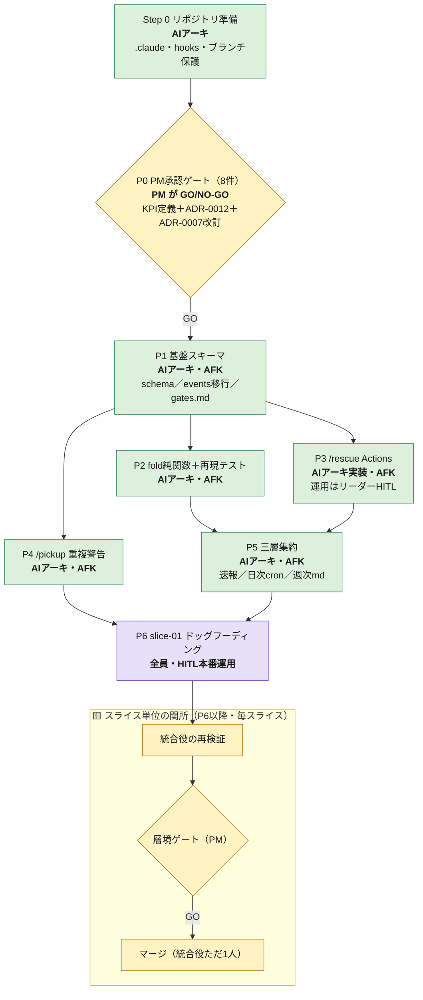

# 手順書：スライス進捗集計アプリの実装から PR 作成まで

> **【スコープ変更・2026-07-11】** 本書は 2026-07-11 に**スライス進捗集計アプリのみの開発**へ
> 全面書き直しした。旧版（業務アプリ再実装・受け入れテスト翻訳フロー）は git 履歴を参照。
> フェーズの詳細（成果物・完了基準・events スキーマ等）の正本は
> `2026-07-11_slice-progress-aggregator_実装ロードマップ.md`（P0〜P6）と
> `2026-07-11_slice-progress-aggregator_確定ログ.md`（#A〜#K・KPI定義）。**本書はその運用手順
> （誰が・どのコマンドで・どの関所を通すか）だけを記述し、詳細を重複させない。**
> `CLAUDE.md`・`docs/adr/` の該当箇所はまだ旧スコープのままで、改訂は PM 承認待ち
> （`docs/memory-bank/pending-scope-pivot-claude-md-and-adr.md` 参照）。

> 誰が・いつ・何をするか。**判断の根拠は `docs/adr/`、用語は `CONTEXT.md`、禁止事項は `CLAUDE.md`。**
> この手順書は「人の動き」の正本。機械の担保（hook / CI）が何を守るかも各工程に併記する。

## 読み方

- **人がやること**と**AI がやること**を分けて書く。上流も下流も**自分の手ではコードを書かない**。
- 各工程に **機械の担保** がある。宣言だけのルールは破られる前提で読むこと。
- AFK＝人が介入しない区間。HITL＝人が判定する関所。

---

## 全体像

```
Step 0 リポジトリ準備（一度きり）
  → P0 PM承認ゲート（8件・HITL）
  → P1 基盤スキーマ（events・schema・gates.md）
  →（P2 fold＋再現テスト ∥ P3 /rescue Actions）並列可
  → P4 /pickup 重複警告（P1後いつでも並列可）
  → P5 三層集約（速報／日次／週次）
  → P6 slice-01 ドッグフーディング（AFK完走を実測）
```

**クリティカルパス**：P0 → P1 →（P2 ∥ P3）→ P5 → P6。
**P0 が通らない限り着手しない**（KPI 定義・ADR は AIアーキ単独では変えられない。CLAUDE.md §7）。

**大原則（不変）**：集計器は Git への投影（projection / read model）。**読むだけ。**
唯一の書き込みは `/rescue`（bot 経由の救援記録）と集計器自身が生成する派生物のみ。

---

## 開発フロー図（誰が・どのフェーズで・どの関所を通すか）



> P0 は KPI 定義・ADR に関わるため唯一の重量 HITL。P1〜P5 は実装であり AFK 可
> （PM 承認済みの枠内・仕様変更なし）。P6 以降は実スライスが流れるため、通常の
> 統合役再検証→層境ゲート→マージの関所が毎回かかる（下記「スライス単位の関所」参照）。

---

## フェーズ × 担当 × 成果物（早見表）

詳細な成果物・完了基準・設計制約は `実装ロードマップ.md` の各節を参照。ここでは運用の要点のみ。

| フェーズ | 主担当 | 承認/判定 | AFK/HITL | 並列 | 成果物 |
|---|---|---|---|---|---|
| Step 0 準備 | AIアーキ | ― | ― | ― | `.claude/` `tools/slice-aggregator/` ブランチ保護 |
| **P0** 承認ゲート（8件） | AIアーキ（起票） | **PM（GO/NO-GO）** | **HITL** | ― | 承認パッケージ＋ADR-0012ドラフト＋ADR-0007改訂 |
| P1 基盤スキーマ | AIアーキ | ― | AFK | ― | `slice-event.schema.json`／`validate-events.yml`／`gates.md`／`issued`イベント発火 |
| P2 fold＋再現テスト | AIアーキ | ― | AFK | P3と並列 | `fold(events, as_of)`純関数／過去7日再現テスト |
| P3 `/rescue` Actions | AIアーキ（実装） | 運用時リーダー記録 | 実装AFK／運用HITL | P2と並列 | `rescue.yml`（bot直コミット・script injection対策込み） |
| P4 `/pickup` 重複警告 | AIアーキ | 運用時リーダー判断 | AFK | P1後いつでも | 範囲交差の advisory 警告 |
| P5 三層集約 | AIアーキ | ― | AFK | ― | PRコメント速報／日次cron/`slice-map.json`／週次md |
| P6 ドッグフーディング | 下流＋全員 | 統合役再検証→PMゲート | HITL（本番運用） | ― | slice-01 の実運用で AFK完走率を実測 |

**機械の担保**：`PreToolUse`（危険コマンド deny-list・protect-paths）、`.github/workflows/validate-events.yml`（P1で新設・events schema検証）。

---

## ロードマップ（v0 → v1）

**v0（現行スコープ）**：GitHub Actions 投影型・サーバー/DB なし・GitHub Pages なし。上記 P0〜P6 のみ。

**v1（範囲外・将来）**：Express + SQLite + Next.js ダッシュボード・`depends_on` による依存解決・
GitHub Pages 公開。「Git の外の読み手（例：経営層）」が現れたときに着手を検討する
（確定ログ #I・#K-(B)）。

---

## Step 0：リポジトリ準備（一度きり）

**担当：AIアーキ**

| # | やること | 落とし穴 |
|---|---|---|
| 1 | `.claude/` 一式・`.mcp.json` を配置 | `chmod +x .claude/hooks/*.sh` を忘れない |
| 2 | **GitHub ブランチ保護**：`main` の PR 必須・force-push 禁止・マージは統合役のみ・**Require branches to be up to date**・**default branch を `main` に設定** | main 防御の**正本**。hook はその二重化にすぎない。default branch の設定漏れは `gh pr create` が誤ったベースを拾う事故につながる（2026-07-11 に実際に発生・修正済み） |

**機械の担保**：`PreToolUse`（危険コマンド deny-list・protect-paths）、`.github/workflows/`（path ガード・秘密チェック）。

---

## P0：PM 承認ゲート（8件・HITL）

**担当：AIアーキ（起票）→ PM（GO/NO-GO）**

KPI 定義（完走率・肥大率・枠効率・差し戻し率の分子分母）と ADR-0012（新設）・ADR-0007（改訂）に
関わるため、**AIアーキ単独では変更できない**（CLAUDE.md §7）。承認パッケージの中身・改訂差分は
`2026-07-11_P0-承認パッケージ.md` を参照。

- 8件は**個別採否**（一括ではない）。`docs/metrics/gates.md` の記録に GO/NO-GO を残す。
- #1・#6・#7 は KPI の意味と不可逆性に直結するため `irreversible` 相当として PM が diff を読む。
- **P0 が通るまで P1 以降は着手しない。**

---

## P1〜P5：実装フェーズ（AFK 可）

**担当：AIアーキ**（P3の運用のみリーダーが `/rescue` コメントで関与）

P0 の承認済みの枠内で、仕様変更を伴わない実装なので AFK で進めてよい。各フェーズの成果物・
完了基準・セキュリティ要件（`/rescue` の script injection 対策・allowlist 等）は
`実装ロードマップ.md` §3〜§7 が正本。ここでは実装そのものにも下記「スライス単位の関所」
（統合役再検証→層境ゲート→マージ）がかかる点だけ強調する。

**設計制約（確定ログより・変更不可）**：

- `slice_id` が主キー（不変・再利用禁止・単調増加）。ファイルパスは主キーにしない。
- events はスライス別ファイル＋append-only（別スライスは別ファイル＝突合が原理的に起きない）。
- 集約（`slice-map.json`／daily／weekly）を書くのは**日次 cron 1本だけ**（`/rescue` や集計器の
  他の経路は集約を触らない＝書き手1つ＝突合ゼロ）。

---

## P6：slice-01 ドッグフーディング（AFK 完走を実測する回）

**担当：M-team 全員**

集計器が実運用に入る最初の回。下流が実際に `/pickup`→`/explore`→`/implement`→`/verify`→`/submit`
の AFK ループを回し、その全イベントが `docs/metrics/events/` に載ることを確認する。

**`/verify` の判定（現行スコープ向けに読み替え）**：

旧版 CLAUDE.md §2 は「受け入れテスト」「golden」を前提にしているが、集計器は UI を持たない
（v0）。P6 時点での実務上の判定は次の3点で代替する（**CLAUDE.md 本体の正式な文言改訂は
PM 承認待ち**。`docs/memory-bank/pending-scope-pivot-claude-md-and-adr.md` 参照）：

1. 対象コードの検証が緑（`validate-events.yml` の schema 検証・`fold` 再現テスト。生ログを提示）
2. — （golden 相当の判定は現行スコープでは対象外）
3. シークレット・PII が差分に無い

**人が止まるべき数値トリガー**（`CLAUDE.md` §3。変更なし）：

| 条件 | 対応 |
|---|---|
| 同一エラー2回 | 停止 → 5 Whys を書いて**リーダーへ報告** |
| 5ファイル変更・Edit 5回超 | 停止 → 影響範囲を報告 |
| 同じテスト3回リトライで赤 | **ハーネスのバグ**として報告。押し切らない |
| diff がコンテキストに収まらない | **スライス設計のバグ**として報告 |

**リーダーへの一次質問は「救援」＝AFK 未完走**。記録は `/rescue`（本アプリ自身の仕組み）で行う
（旧版の `docs/metrics/slices.md` 手動記録から移行）。

**PR 作成は AFK の内側。人は PR を作らない。** **緑 ≠ 仕様充足**なので、ここで停止して報告する。

---

## スライス単位の関所（P6 以降・毎スライス）

### 統合役の再検証（HITL 準備）

**担当：統合役（下流・中級）**

| やること | やらないこと |
|---|---|
| **当該スライスの検証**（schema検証・fold再現テスト等）をローカルで再実行する | 全件は回さない（CI の仕事） |
| シークレット・PII チェック | |
| **差分の目視**：指示書に無い変更・意図しないツール呼び出しの痕跡がないか | |

再実行の目的は**再現性の確認**。**NG なら層境ゲートに進まず、下流の `/implement` へ差し戻す。**

### 層境ゲート（HITL 判定）

**担当：PM（代理：リーダー1名）**

**全 PR にゲートを掛ける。重さは CI が機械的に決める**（ADR-0007。改訂：`gates.md` に
`NO-GO:rework`／`NO-GO:redecompose` の区別を必須化）。

| ゲート | 判定者がやること | 対象 |
|---|---|---|
| **軽量** | Audit の推奨判定と統合役の再検証結果を**読んで** GO/NO-GO。diff は自分で読まない | それ以外 |
| **重量** | **diff を自分で読む。** Audit の GO を鵜呑みにしない | `irreversible` ラベル付き（`docs/adr/0012-*.md`・`0007`改訂・`gates.md`の運用開始等） |

- **Audit は推奨。PM を拘束しない。** `GO` でも NO-GO を出せる。
- **代理はリーダー1名のみ。** `gates.md` に `代理: リーダー` と記録し、PM が事後に確認する。

### マージ（不可逆操作）

**担当：統合役ただ1人**

- commit / push を実行する。**この1点にすべての不可逆操作が集約されている。**
- `gh pr create` は**必ず `--base main` を明示する**（default branch 誤設定・default 依存で
  意図しないブランチへマージされる事故が2026-07-11に実際発生。修正済みだが再発防止のため明記）。
- コミットは意味単位。記述的なメッセージ（外部記憶になる）。
- `git log --oneline -3` と `git status` の**生出力**で実態を確認する。「Worked」「Cooked」は成功の証拠ではない。

---

## 却下されたら `/flywheel`

**担当：Harness-Keeper（＝AIアーキの帽子）**

1. **原因を2分類する。** これを飛ばさない。

   | 分類 | 行き先 |
   |---|---|
   | **スライス設計の欠陥**（大きすぎ・受入基準過多・依存の見落とし） | PM へ |
   | **ハーネスの欠陥**（枠・skills・hooks・エージェント定義） | AIアーキへ（`.claude/` の修正） |

2. **強制力の階段を1段だけ上げる。飛び級しない。**

   ```
   なし → 宣言（CLAUDE.md / 指示書 / skills）→ 実行時強制（hook / permissions / tools）→ 事後検証（CI / ブランチ保護）
   ```

   - **2ストライクルール**：同じ修正指示を2回したら宣言に書く。1回では書かない。
   - **書いてあるのに破られたら hook へ昇格。** まずファイルが長すぎてルールが埋もれていないか疑う。

3. `CLAUDE.md`（憲法）への昇格だけは **PM 承認必須**。草案は `docs/memory-bank/pending-*.md` に隔離する。自律エージェントに憲法を書き換えさせない。

4. **1行足すなら1行削れないか見る。** 基準は「**この行を消したら Claude はミスをするか？**」——No なら消す。**古いルールは欠落より有害。**

---

## 誰が何を所有するか（早見表）

| 成果物 | 場所 | 執筆 | 承認 |
|---|---|---|---|
| 憲法 | `CLAUDE.md` | AIアーキ（体裁） | **PM** |
| 用語 | `CONTEXT.md` | 上流全体 | Harness-Keeper 単独可 |
| 決定 | `docs/adr/` | 上流全体 | Harness-Keeper 単独可 |
| P0 承認パッケージ | ルート直下（例: `*_P0-承認パッケージ.md`） | AIアーキ | **PM** |
| スライス一覧 | `docs/slices/README.md` | PM＋AIアーキ | PM |
| スライス指示書 | `docs/slices/slice-NN.md` | PM＋AIアーキ＋**リーダー**（枠・禁止事項） | PM |
| events スキーマ・fold実装 | `tools/slice-aggregator/` | **AI**（AIアーキが動かす） | **PM**（P0）／層境ゲート |
| KPI イベント | `docs/metrics/events/**` | bot（`/rescue` 経由）＋日次cron | ADR-0012 の allowlist・schema検証 |
| 集約派生物 | `docs/metrics/index/`・`docs/status/` | 日次cron（1本のみ） | ― |
| ハーネス | `.claude/` `tools/` | AIアーキ | AIアーキ |

**リーダーは関所を持たない。** 責務は「下流の一次窓口」「枠・禁止事項の文言」「救援の記録
（`/rescue`）」の3つ、および PM の代理。

---

## ハーネス側の未実装（本書を成立させるために要るもの）

| # | やること | 根拠 |
|---|---|---|
| 1 | ✅済（2026-07-11）hook の `git push` 禁止を「**main を進める操作**のみ」に緩めた | main を進める操作は統合役ただ1人 |
| 2 | ✅済（2026-07-11）default branch を `main` に修正 | `gh pr create` の誤ベース事故を防ぐ |
| 3 | `slice-event.schema.json`＋`validate-events.yml`（P1） | events の不正行を PR 時に弾く |
| 4 | `docs/metrics/gates.md` 本運用化（先行作成済み・status: proposed）：NO-GO種別列 | ADR-0007改訂（P0 #6 GO後） |
| 5 | `rescue.yml`（P3）：script injection対策・allowlist・append-only直コミット | ADR-0012（P0 #7 GO後） |
| 6 | `fold` 純関数＋過去7日再現テスト（P2） | 非決定性検出 |
| 7 | `/pickup` への重複警告・再作成2回超の注意喚起文追記（P4） | 確定ログ #G'・#K-(A) |
| 8 | 三層集約（PRコメント速報／日次cron／週次md）（P5） | 確定ログ #I・#J |
| 9 | `irreversible` ラベルを自動付与する CI（対象パスを `docs/adr/0012-*.md`・`gates.md` 等に更新） | ADR-0007 |
| 10 | CLAUDE.md・該当ADR（0001/0002/0004/0005/0008/0009/0010/0011）の正式改訂 | PM承認待ち（`docs/memory-bank/pending-scope-pivot-claude-md-and-adr.md`） |
