# 手順書：基本設計から PR 作成まで

> **【スコープ変更に伴う注記・2026-07-11】** 現行スコープは**スライス進捗集計アプリのみの開発**。
> 本書のうち `acceptance/`・`reference-mock/`・`docs/spec/`・golden・Express/Next.js 実装を前提にした
> 工程（工程3・4、Step 0 の vendor 手順、Step 3 の受け入れテスト CI 等）は現行スコープでは未使用。
> 層境ゲート・役割分担・ブランチ規律など汎用的な運用部分は引き続き有効。実装フェーズは
> `2026-07-11_slice-progress-aggregator_実装ロードマップ.md`（P0〜P6）を参照。改訂は PM 承認待ち。

> 誰が・いつ・何をするか。**判断の根拠は `docs/adr/`、用語は `CONTEXT.md`、禁止事項は `CLAUDE.md`。**
> この手順書は「人の動き」の正本。機械の担保（hook / CI）が何を守るかも各工程に併記する。

## 読み方

- **人がやること**と**AI がやること**を分けて書く。上流も下流も**自分の手ではコードを書かない**。
- 各工程に **機械の担保** がある。宣言だけのルールは破られる前提で読むこと。
- AFK＝人が介入しない区間。HITL＝人が判定する関所。

---

## 全体像

```
【一度きり】 Step 0 リポジトリ準備 → 工程1 基本設計 → 工程2 issue 分解
【毎スライス・上流】 工程3 仕様表 → 工程4 /spec → 工程5 /brief
【毎スライス・下流】 工程6 /slice（AFK）
【毎スライス・関所】 工程7 統合役の再検証 → 工程8 層境ゲート → 工程9 マージ
【却下されたら】 工程10 /flywheel
```

**順序は固定。** 特に「失敗する受け入れテストが main にある」状態を作ってから issue を配ること（工程4→5）。逆にすると下流の `/pickup` が指示書「2. 受け入れテスト」を指せない。

---

## 開発フロー図（誰が・どのコマンドで・どの道具を使うか）

```mermaid
flowchart TD
    subgraph ONCE["🟩 一度きり（キックオフ）"]
        S0["Step 0 リポジトリ準備<br/><b>AIアーキ</b><br/>―<br/>vendor / ブランチ保護 / hooks 配置"]
        P1["工程1 基本設計<br/><b>AIアーキ→PM承認</b><br/>素の会話 ＋ grill-with-docs<br/>→ docs/design/overview.md"]
        P2["工程2 issue 分解<br/><b>PM＋AIアーキ</b><br/>to-issues<br/>→ docs/slices/README.md"]
        S0 --> P1 --> P2
    end

    subgraph UP["🟩 毎スライス・上流"]
        P3["工程3 仕様表<br/><b>PM</b>（手で書く）<br/>→ docs/spec/slice-NN.md"]
        P4["工程4 <b>/spec &lt;slice&gt;</b><br/><b>AIアーキ</b>が叩く<br/>runner＋Playwright＋Context7<br/>→ acceptance/ ＋ golden/"]
        G1{"重量ゲート<br/><b>PM</b> が diff を読む"}
        P5["工程5 <b>/brief &lt;slice&gt;</b><br/><b>リーダー</b>＋AIアーキ＋PM<br/>GitHub MCP で issue 起票<br/>→ docs/slices/slice-NN.md"]
        P3 --> P4 --> G1 -- GO --> P5
    end

    subgraph DOWN["🟦 毎スライス・下流（AFK：人は介入しない）"]
        D1["<b>/pickup</b> — GitHub MCP で issue<br/>指示書は repo から読む"]
        D2["<b>/explore</b> — Explore(Haiku)<br/>Read/Grep/Glob のみ"]
        D3["<b>/implement</b> — runner で起動<br/>/tdd・/diagnose・Context7<br/>緑までループ"]
        D4["<b>/verify</b> — 3判定を機械で○×"]
        D5["<b>/submit</b> — push＋PR(GitHub MCP)<br/>Audit(Opus) が推奨判定<br/>KPI 1行記録"]
        D1 --> D2 --> D3 --> D4
        D4 -- "✗" --> D3
        D4 -- "全て○" --> D5
    end

    subgraph GATE["🟨 関所（HITL）"]
        H1["工程7 再検証<br/><b>統合役</b><br/>当該スライス＋秘密＋差分"]
        H2{"工程8 層境ゲート<br/><b>PM</b>（代理：リーダー1名）<br/>軽量／重量は CI ラベルで決まる"}
        H3["工程9 マージ<br/><b>統合役ただ1人</b><br/>commit / push / migration"]
        H1 --> H2 -- "GO" --> H3
    end

    FW["工程10 <b>/flywheel</b><br/><b>Harness-Keeper</b>（AIアーキ）<br/>→ ADR / CONTEXT.md / hook 昇格草案"]

    P2 --> P3
    P5 -->|"issue 番号を渡す"| Human(["👤 実装メンバー<br/>/slice 42 と打つだけ"])
    Human --> D1
    D5 --> H1
    H1 -. "NG：差し戻し" .-> D3
    H2 -. "NO-GO" .-> FW
    FW -.->|"スライス設計の欠陥"| P2
    FW -.->|"ハーネスの欠陥"| S0

    classDef once fill:#DCF0DC,stroke:#2F855A,color:#1a1a1a
    classDef up fill:#DCF0DC,stroke:#2F855A,color:#1a1a1a
    classDef down fill:#D7E9F7,stroke:#2B6CB0,color:#1a1a1a
    classDef gate fill:#FFF3C4,stroke:#B7791F,color:#1a1a1a
    classDef fly fill:#E6E0F8,stroke:#6B46C1,color:#1a1a1a
    classDef human fill:#FFF3C4,stroke:#B7791F,color:#1a1a1a,stroke-width:2px

    class S0,P1,P2 once
    class P3,P4,P5 up
    class D1,D2,D3,D4,D5 down
    class G1,H1,H2,H3 gate
    class FW fly
    class Human human
```



> **凡例**：緑＝上流／青＝下流（AFK）／黄＝人が判定する関所（HITL）／紫＝Flywheel の書き戻し。
> 実線＝幸福経路、点線＝差し戻し。**人がスラッシュを叩くのは起点だけ**で、終点の判定まで無人で回る。

---

## 工程 × 担当 × 道具（早見表）

**下流が叩くのは `/slice` の1本だけ。** MCP とサブエージェントは skill が内部で呼ぶので、下流は触らない。

| 工程 | 人（判断） | 叩くコマンド | 使う skill | 使う MCP | サブエージェント | 成果物 |
|---|---|---|---|---|---|---|
| **Step 0** 準備 | AIアーキ | ―（手作業） | ― | ― | ― | `.claude/` `reference-mock/` ブランチ保護 |
| **工程1** 基本設計 | AIアーキ→**PM 承認** | ―（素の会話） | `grill-with-docs` | ― | ― | `docs/design/overview.md` |
| **工程2** issue 分解 | PM＋AIアーキ | ― | `to-issues` | ― | ― | `docs/slices/README.md` |
| **工程3** 仕様表 | **PM**（人が書く） | ― | spec-kit の Review Checklist（抜粋） | ― | ― | `docs/spec/slice-NN.md` |
| **工程4** 翻訳＋golden | AIアーキ／**PM がゲート** | **`/spec <slice>`** | 自作 | **runner**（起動）＋**Context7**（最新API）＋**GitHub**（PR） | ― | `acceptance/` `acceptance/golden/` |
| **工程5** 指示書＋起票 | **リーダー**（枠・禁止事項）＋AIアーキ（技術の形）＋PM（受入基準） | **`/brief <slice>`** | 自作 | **GitHub**（issue 起票） | ― | `docs/slices/slice-NN.md` ＋ issue |
| **工程6-1** pickup | 実装メンバー | `/slice <issue>` が内部実行 | 自作 | **GitHub**（issue 取得） | ― | `feature/slice-NN` ブランチ |
| **工程6-2** explore | 〃 | 〃 | 自作 | ― | **Explore**（Haiku・Read/Grep/Glob） | 触ってよい範囲の地図 |
| **工程6-3** implement | 〃 | 〃 | 自作 ＋ **`/tdd`** ＋ **`/diagnose`** | **runner**（起動・ログ）＋**Context7** | ― | 緑になった実装 |
| **工程6-4** verify | 〃 | 〃 | 自作 | **runner** | ― | 3判定の○× |
| **工程6-5** submit | 〃 | 〃 | 自作 | **GitHub**（push・PR） | **Audit**（Opus・Bash なし・`express-review-rules` を参照） | PR ＋ 推奨判定 ＋ KPI 1行 |
| **工程7** 再検証 | **統合役** | ―（手で runner を回す） | ― | **runner** | ― | 再現性の確認結果 |
| **工程8** 層境ゲート | **PM**（代理：リーダー1名） | ―（GitHub 上で判断） | ― | ― | ― | GO / NO-GO |
| **工程9** マージ | **統合役ただ1人** | ―（git／gh） | ― | ― | ― | main の前進 |
| **工程10** 書き戻し | Harness-Keeper（AIアーキ） | **`/flywheel`** | 自作 | ― | ― | ADR／`CONTEXT.md`／hook 昇格草案 |

**道具の正体**

| 種別 | 名前 | 誰が呼ぶか |
|---|---|---|
| MCP | `teamdev-test-runner`（runner） | skill が内部で呼ぶ。**起動するだけ。採点はテストFW** |
| MCP | `Context7` | `/implement` `/spec`。存在しない API のリトライを潰す |
| MCP | `GitHub`（toolsets: issues, pull_requests） | `/pickup` `/submit` `/brief` |
| 既製 skill | `/tdd` `/diagnose`（mattpocock） | `/implement` が内部で呼ぶ |
| 既製 skill | `grill-with-docs` `to-issues`（mattpocock） | 上流が直接使う |
| サブエージェント | `Explore`（Haiku・read-only） | `/explore` が起動。地図だけ返す |
| サブエージェント | `Audit`（Opus・Bash なし） | `/submit` が diff を注入して起動。**推奨判定のみ。マージしない** |
| 監査型 skill | `express-review-rules`（`user-invocable: false`） | Audit が背景知識として読む |

> **制御はメインセッションが握る（ハブ＆スポーク）。** サブエージェント同士はバトンを渡さない。
> **並列にしない。** Opus は Audit にのみ温存する。

---

## ロードマップ（いつ何を足すか）

ハーネスは一度に全部作らない。**効果最大・コスト最小から**積む。

| フェーズ | いつ | 足すもの | 完了条件 |
|---|---|---|---|
| **Step 1** | キックオフ週 | CLAUDE.md 剪定／`PreToolUse`（危険コマンド deny-list＋protect-paths）／runner で pass/fail シグナルを確保 | ✅ **完了済み** |
| **Step 2** | 初スプリント中 | `PostToolUse`（lint＋型チェックの feedback）／`Stop` hook／`acceptance/` の read-only 三層化／`/spec` `/brief` の作成／golden 閾値の較正 | 下流が `/slice` を1本完走 |
| **Step 3** | **スライス5本 or 初スプリント末**（早い方） | **受け入れテスト CI**（`reference-mock`＋`backend`＋`frontend`＋Playwright）／`irreversible` ラベル自動付与／**依存方向のカスタム lint** | リグレッションが機械で止まる |
| **Step 4** | 結合E2E期以降 | Playwright MCP（診断専用）／DBHub（read-only）／doc-gardening | ― |

**Step 3 は期限を切ってある**（ADR-0010）。それまでは統合役が全スイートをローカル実行して代替するが、
**「個別に緑な2つの PR がマージ後に赤」は構造的に検出できない**。人の落ち度ではない。

**Step 3 の3点は Express 化の帰結でもある**（ADR-0011）。フレームワークが構造を強制しないので、
`router → service → repository` の依存方向は**カスタム lint で機械強制しないと必ず崩れる**。

### 初スプリントで通すもの（目的C）

**下流全員が最初の1スライスを完走する**（Time-to-first-green）。最初の縦切りは **報告 → 要約 → 確認 → 確定**。
参照モックで検証済みの経路なので、初回の成功確率が最も高い。

---

## Step 0：リポジトリ準備（一度きり）

**担当：AIアーキ**

| # | やること | 落とし穴 |
|---|---|---|
| 1 | **参照モックのシード棚卸し** | 既存 `staff-report-system` のフィクスチャが実データ由来なら、vendor した瞬間に憲法 §1-5 違反が repo に入る。**合成データであることを確認してから次へ** |
| 2 | `reference-mock/` として git subtree で vendor | ADR-0005。以後 read-only |
| 3 | `.claude/` 一式・`.mcp.json`・`tools/teamdev-test-runner-mcp/` を配置 | `chmod +x .claude/hooks/*.sh` を忘れない |
| 4 | `backend/` `frontend/` `reference-mock/` に `test-harness.runtime.json` を置く | runner の `examples/` を雛形にする |
| 5 | Playwright のブラウザ版を pin | golden 比較が OS/フォントで割れる。ADR-0008 |
| 6 | **GitHub ブランチ保護**：`main` の PR 必須・force-push 禁止・マージは統合役のみ・**Require branches to be up to date** | main 防御の**正本**。hook はその二重化にすぎない。最後の項目が抜けると「個別に緑な2 PR がマージ後に赤」になる。ADR-0010 |

**機械の担保**：`PreToolUse`（危険コマンド deny-list・protect-paths）、`guard-acceptance.yml`（path ガード・秘密チェック）。

---

## 工程1：基本設計（一度きり）

**担当：PM（承認）／ AIアーキ（AI を動かす）**

**このプロジェクトの「基本設計」は設計ではなく、answer key の書き起こし。** 参照モックが既に正解の挙動を持っている。ゼロから API を考えない。

| 誰 | やること |
|---|---|
| AIアーキ | AI に `reference-mock/` を読ませ、`docs/design/overview.md` を起こさせる |
| AI | 画面一覧／API 一覧（パス・メソッド・**ステータスコード**）／データモデル／`Summarizer` の境界／**スコープ外の明示** |
| AIアーキ | 参照モックのルーターを `router / service / repository` の3層へどう写すかを決める（ADR-0011）。**フレームワークが構造を与えないので、ここを曖昧にすると Java 移行で破綻する** |
| PM | 読んで承認する。参照モックに無い＝**新しく決める部分**があれば、そこだけを設計として切り出す |
| 上流全体 | 用語のブレを `CONTEXT.md` に、決定を `docs/adr/` に落とす（`grill-with-docs`） |

- **MVP 全体で1本。** スライスごとに書き足さない。以降の更新は Flywheel 経由。
- コマンド化しない。1回きりの判断業務。素の会話で回す。

**落とし穴**：参照モックにない部分（＝本当の設計）と、書き起こし部分を混ぜないこと。混ぜると上流が「全部を一から考える」モードに入り、初スプリントが溶ける。

---

## 工程2：issue 分解（一度きり）

**担当：PM（優先順位・依存）／ AIアーキ（技術的な形）**

- 道具は `to-issues`（mattpocock）。成果物は **`docs/slices/README.md`**（スライス一覧と依存順）。
- **切り方は縦切り（tracer bullet）。** 層別（バックエンドだけ・画面だけ）にしない。
- **粒度の基準：受入基準 ≤3〜5。** 1 issue = 1 スライス = 1 セッション。
- 最初の縦切りは **報告 → 要約 → 確認 → 確定**（参照モックで検証済みの経路。初回成功確率が最も高い）。

**この時点では issue を GitHub に起票しない。** 起票は工程5。

---

## 工程3：仕様表を書く（毎スライス）

**担当：PM**

- 成果物：**`docs/spec/slice-NN.md`**。Given/When/Then。**これが仕様の正本。**
- 合成フィクスチャもここで確定する（PM 所有）。各フィールドの L0/L1/L2 階層を割り当てる。
- spec-kit から抜粋した **Review & Acceptance Checklist** でセルフレビューする。

**PM が書かないと工程4 が始まらない。** `/spec` は仕様表が無ければ停止する。

---

## 工程4：`/spec <slice>`（毎スライス）

**担当：AIアーキ（AI を動かす）／ PM（重量ゲートで承認）**

`spec/slice-NN` ブランチ上で、`/spec` が以下を**順序固定**で実行する。

```
1. spec/slice-NN ブランチを切る
2. docs/spec/slice-NN.md を読む         ← 無ければ停止
3. AI が acceptance/ へ翻訳する
4. reference-mock を起動 → スイートを流す → 【緑】を確認   ← 翻訳が正しい証明
5. golden スクショを撮り acceptance/golden/ へ            ← 実装より先に撮る
6. backend を起動 → スイートを流す → 【赤】を確認          ← 下流に渡せる証明
7. PR を作る
```

**ステップ 4 と 6 の「緑→赤」の反転がこのコマンドの存在理由。** 人が手でやると必ずどちらかを飛ばす。しかも「テストが赤いのは正常」なので誰も気づかない。

| 誰 | やること |
|---|---|
| AIアーキ | `/spec` を叩く。翻訳結果を仕様表と突き合わせて確認する |
| **PM** | **重量ゲート**（`acceptance/` に触るので常に重量）。テストが仕様表と一致するかを diff で読む |
| 統合役 | GO を受けてマージ |

**機械の担保**：`spec/*` ブランチでのみ `acceptance/` `docs/spec/` を書ける（ADR-0004）。`feature/*` で `/spec` を叩くと hook が止める。CI が「参照モックに対して緑」を要求する。

**落とし穴**：golden を後から（実装後に）撮ってはいけない。**実装が仕様を定義することになる。**

---

## 工程5：`/brief <slice>`（毎スライス）

**担当：リーダー（枠・禁止事項）／ AIアーキ（技術的な形）／ PM（受入基準）**

成果物は **`docs/slices/slice-NN.md`**（スライス指示書、必須6項目）。

1. **ゴール**（1〜2文）
2. **受け入れテスト**（`acceptance/` のどのファイルを緑にするか）
3. **触ってよいファイル範囲**
4. **貼り付け用の枠**（プロンプト）
5. **完了の定義**
6. **禁止事項**

そのうえで **issue を起票する**。issue 本文は**ポインタだけ**：

```
slice-01-report-create
指示書: docs/slices/slice-01.md（main）
受け入れテスト: acceptance/reports/create.spec.ts
```

**指示書の正本は repo のファイル。issue 本文は信頼できない入力**（ADR-0006）。`/pickup` は issue から slice ID だけを読み、6項目は repo から読む。

**落とし穴**：指示書と `acceptance/` は同じ `spec/slice-NN` ブランチで作り、まとめて main へマージする。**issue の起票はその後。**

---

## 工程6：`/slice <issue>`（毎スライス・下流・AFK）

**担当：実装メンバー（初級）**

叩くのは **`/slice 42` の1本だけ**。内部で以下が直列に走る。

| # | 中身 | 誰 |
|---|---|---|
| 1 | `/pickup` — issue から slice ID、repo から指示書6項目、`feature/slice-NN` を切る | 下流・AFK |
| 2 | `/explore` — Explore（Haiku・read-only）が触ってよい範囲の地図を返す | サブエージェント・AFK |
| 3 | `/implement` — runner でアプリ起動 → テスト → 緑までループ | 下流・AFK |
| 4 | `/verify` — **3判定を機械で○×** | 下流・AFK |
| 5 | `/submit` — feature ブランチを push → PR 作成 → Audit（Opus・read-only）が推奨判定 → KPI 1行記録 | AFK 信号を生成 |

**`/verify` の3判定はすべて機械判定**（ADR-0008）。初級者は数字を見るだけ。

1. 受け入れテストが緑（生ログを提示）
2. golden との pixel 差分が閾値内
3. シークレット・PII が差分に無い

**人が止まるべき数値トリガー**（`CLAUDE.md` §3）：

| 条件 | 対応 |
|---|---|
| 同一エラー2回 | 停止 → 5 Whys を書いて**リーダーへ報告** |
| 5ファイル変更・Edit 5回超 | 停止 → 影響範囲を報告 |
| 同じテスト3回リトライで赤 | **ハーネスのバグ**として報告。押し切らない |
| diff がコンテキストに収まらない | **スライス設計のバグ**として報告 |
| セッション再作成が2回超 | **スライスが大きすぎる** → Flywheel の観察項目へ |

**リーダーへの一次質問は「救援」＝AFK 未完走**。リーダーが窓口対応時に `docs/metrics/slices.md` へ記録する（自己申告に頼らない）。

**PR 作成は AFK の内側。人は PR を作らない。** ここまでが下流の仕事。**緑 ≠ 仕様充足**なので、ここで停止して報告する。

---

## 工程7：統合役の再検証（HITL 準備）

**担当：統合役（下流・中級）**

| やること | やらないこと |
|---|---|
| **当該スライスのスイート**をローカルで再実行する | 全スイートは回さない（CI の仕事。ADR-0010） |
| シークレット・PII チェック | |
| **差分の目視**：指示書に無い変更・意図しないツール呼び出しの痕跡がないか | |

再実行の目的は**再現性の確認**（「下流の環境でだけ緑だった」を潰す）。網羅ではない。

**NG なら層境ゲートに進まず、下流の `/implement` へ差し戻す。**

> **初スプリント中の暫定運用**（ADR-0010）：CI がまだ無いので、統合役が全スイートをローカル実行して代替する。
> **スライスが5本たまるか、初スプリント終了時のどちらか早い方で CI を組む。**
> この期間、「個別に緑な2つの PR がマージ後に赤」は**構造的に検出できない**。統合役の落ち度ではない。

---

## 工程8：層境ゲート（HITL 判定）

**担当：PM（代理：リーダー1名）**

**全 PR にゲートを掛ける。重さは CI が機械的に決める**（ADR-0007）。

| ゲート | 判定者がやること | 対象 |
|---|---|---|
| **軽量** | Audit の推奨判定と統合役の再検証結果を**読んで** GO/NO-GO。diff は自分で読まない | それ以外 |
| **重量** | **diff を自分で読む。** Audit の GO を鵜呑みにしない | `irreversible` ラベル付き |

`irreversible` ラベルは CI が自動で貼る：`prisma/schema.prisma` / `**/migrations/**` / 認可コード / `acceptance/**`。

- **Audit は推奨。PM を拘束しない。** `GO` でも NO-GO を出せる。
- **代理はリーダー1名のみ。** 全ゲートで代理可。ただし `docs/metrics/gates.md` に `代理: リーダー` と記録し、PM が事後に確認する。
- 「重要そうだから丁寧に見よう」という運用判断はしない。**破られる。**

---

## 工程9：マージ（不可逆操作）

**担当：統合役ただ1人**

- commit / push / DB マイグレーションを実行する。**この1点にすべての不可逆操作が集約されている。**
- コミットは意味単位。記述的なメッセージ（外部記憶になる）。
- `git log --oneline -3` と `git status` の**生出力**で実態を確認する。「Worked」「Cooked」は成功の証拠ではない。

---

## 工程10：却下されたら `/flywheel`

**担当：Harness-Keeper（＝AIアーキの帽子）**

1. **原因を2分類する。** これを飛ばさない。

   | 分類 | 行き先 |
   |---|---|
   | **スライス設計の欠陥**（大きすぎ・受入基準過多・依存の見落とし） | PM へ（issue 分解の見直し） |
   | **ハーネスの欠陥**（枠・skills・hooks・エージェント定義） | AIアーキへ（`.claude/` の修正） |

2. **強制力の階段を1段だけ上げる。飛び級しない。**

   ```
   なし → 宣言（CLAUDE.md / 指示書 / skills）→ 実行時強制（hook / permissions / tools）→ 事後検証（CI / ブランチ保護）
   ```

   - **2ストライクルール**：同じ修正指示を2回したら宣言に書く。1回では書かない。
   - **書いてあるのに破られたら hook へ昇格。** まずファイルが長すぎてルールが埋もれていないか疑う。

3. `CLAUDE.md`（憲法）への昇格だけは **PM 承認必須**。草案は `docs/memory-bank/pending-*.md` に隔離する。自律エージェントに憲法を書き換えさせない。

4. **1行足すなら1行削れないか見る。** 基準は「**この行を消したら Claude はミスをするか？**」——No なら消す。**古いルールは欠落より有害。**

---

## 誰が何を所有するか（早見表）

| 成果物 | 場所 | 執筆 | 承認 |
|---|---|---|---|
| 憲法 | `CLAUDE.md` | AIアーキ（体裁） | **PM** |
| 用語 | `CONTEXT.md` | 上流全体 | Harness-Keeper 単独可 |
| 決定 | `docs/adr/` | 上流全体 | Harness-Keeper 単独可 |
| 基本設計 | `docs/design/overview.md` | **AI**（AIアーキが動かす） | **PM** |
| スライス一覧 | `docs/slices/README.md` | PM＋AIアーキ | PM |
| 仕様表 | `docs/spec/slice-NN.md` | **PM** | PM |
| 受け入れテスト・golden | `acceptance/` | **AI**（AIアーキが動かす） | **PM**（重量ゲート） |
| スライス指示書 | `docs/slices/slice-NN.md` | PM＋AIアーキ＋**リーダー**（枠・禁止事項） | PM |
| 実装 | `backend/`（Express 3層）`frontend/` | **AI**（下流が動かす） | **PM**（層境ゲート） |
| ハーネス | `.claude/` `tools/` | AIアーキ | AIアーキ |
| KPI | `docs/metrics/` | `/submit`＋リーダー | Harness-Keeper |

**リーダーは関所を持たない。** 責務は「下流の一次窓口」「枠・禁止事項の文言」「救援の記録」の3つ、および PM の代理。

---

## ハーネス側の未実装（この手順書を成立させるために要るもの）

| # | やること | 根拠 |
|---|---|---|
| 1 | ✅済（2026-07-11）hook の `git push` 禁止を「**main を進める操作**のみ」に緩めた（feature/spec ブランチの commit/push は許可。ブランチ判定） | PR 作成が AFK の内側にあるため |
| 2 | ✅済（2026-07-11）`protect-paths.sh` をブランチ判定に：`spec/*` は `acceptance/`・`docs/spec/` 書込可＋実装不可、`feature/*` はその逆 | ADR-0004 |
| 3 | ✅済（2026-07-11）CI の path ガードを `head_ref` 判定に（hook と同一条件式） | ADR-0004 |
| 4 | ✅済（2026-07-11）`/spec` `/brief` skill を作成。工程とブランチの縛りは skill 冒頭のブランチ確認＋protect-paths（#2）で担保 | ADR-0009 |
| 5 | ✅済（2026-07-11）`reference-mock/` を protect-paths に追加（全ブランチ read-only） | ADR-0005 |
| 6 | `acceptance/` を `ACCEPTANCE_BASE_URL` 対応にする | ADR-0005 |
| 7 | golden 比較を `/verify` に組み込む（`toHaveScreenshot`・閾値・`mask`） | ADR-0008 |
| 8 | `irreversible` ラベルを自動付与する CI | ADR-0007 |
| 9 | ✅済（2026-07-11 先行作成。status: proposed、P0 #6 GO 後に本運用）`docs/metrics/gates.md`（代理判定の記録・NO-GO 種別列つき） | ADR-0007 |
| 10 | `/submit` の diff 基準を `git fetch origin && git diff origin/main...HEAD` に直す | ローカル `main` が古いと Audit が嘘の diff を読む |
| 11 | `/verify` の秘密チェックを PII パターン（メール・電話・マイナンバー形式）まで拡張 | 計画書 §6 M-2 |
| 12 | 受け入れテスト CI（スライス5本 or 初スプリント末）。`reference-mock`(Python) ＋ `backend`(Express) ＋ `frontend` を起動 | ADR-0010 |
| 13 | **依存の向きを縛るカスタム lint**（`router → service → repository` の一方向。エラーメッセージに修正手順を書く） | ADR-0011 |
